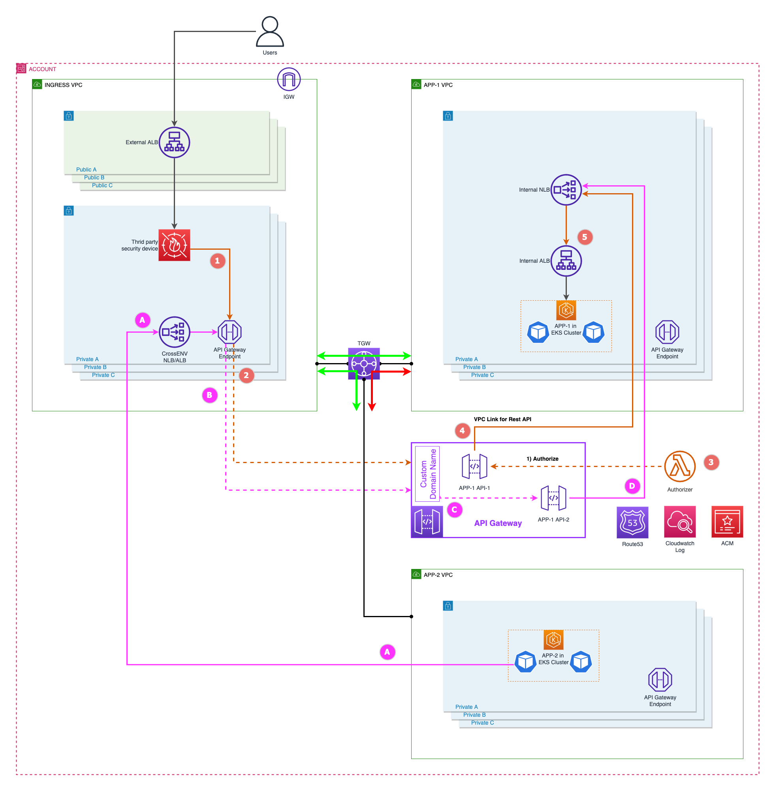

```ad-attention
title: This is a github note

```

# TC-private-api-cross-environment-traffic

- [architecture summary](#architecture-summary)
- [setup your lab environment](#setup-your-lab-environment)
	- [prep vpc](#prep-vpc)
	- [prep cross env nlb in c9 vpc](#prep-cross-env-nlb-in-c9-vpc)
	- [prep api](#prep-api)


## architecture summary



## setup your lab environment

### before lab

please complete lab and then go to next step
https://github.com/panlm/blog-private-api-gateway-dataflow/blob/main/TC-private-apigw-dataflow.md

### prep vpc

- env in cloud9
```sh
CLUSTER_NAME=ekscluster1
AWS_REGION=$(curl -s 169.254.169.254/latest/dynamic/instance-identity/document | jq -r '.region')
export AWS_DEFAULT_REGION=${AWS_REGION}
export AWS_PAGER=""
```

- create TGW
```sh
tmp=$(mktemp)
aws ec2 create-transit-gateway \
--description "My TGW" |tee $tmp.1
TGW_ID=$(cat $tmp.1 |jq -r '.TransitGateway.TransitGatewayId')

watch -g -n 60 aws ec2 describe-transit-gateways \
--transit-gateway-ids $TGW_ID \
--query 'TransitGateways[].State' --output text
```

^yq2usv

- attach cloud9 VPC to TGW
```sh
C9_INST_ID=$(curl -s http://169.254.169.254/latest/meta-data/instance-id)
C9_VPC_ID=$(aws ec2 describe-instances \
--instance-ids ${C9_INST_ID} \
--query 'Reservations[0].Instances[0].VpcId' --output text)
C9_CIDR=$(aws ec2 describe-vpcs \
--vpc-ids ${C9_VPC_ID} \
--query Vpcs[].CidrBlock --output text)

VPC_ID=${C9_VPC_ID}
SUBNET_IDS=$(aws ec2 describe-subnets \
--filters "Name=vpc-id,Values=${VPC_ID}" \
--query 'Subnets[].SubnetId' \
--output text |xargs)

aws ec2 create-transit-gateway-vpc-attachment \
--transit-gateway-id ${TGW_ID} \
--vpc-id ${VPC_ID} \
--subnet-ids ${SUBNET_IDS} \
--tag-specifications 'ResourceType=transit-gateway-attachment,Tags=[{Key=Name,Value=att-'"${VPC_ID}"'}]'
```

^x1asti

- attach eks VPC to TGW
```sh
EKS_VPC_ID=$(aws eks describe-cluster \
--name ${CLUSTER_NAME} \
--query "cluster.resourcesVpcConfig.vpcId" --output text )
EKS_CIDR=$(aws ec2 describe-vpcs \
--vpc-ids ${EKS_VPC_ID} \
--query Vpcs[].CidrBlock --output text)

VPC_ID=${EKS_VPC_ID}
SUBNET_IDS=$(aws ec2 describe-subnets \
--filters "Name=vpc-id,Values=${VPC_ID}" \
--query 'Subnets[?MapPublicIpOnLaunch==`false`].SubnetId' \
--output text |xargs)

aws ec2 create-transit-gateway-vpc-attachment \
--transit-gateway-id ${TGW_ID} \
--vpc-id ${VPC_ID} \
--subnet-ids ${SUBNET_IDS} \
--tag-specifications 'ResourceType=transit-gateway-attachment,Tags=[{Key=Name,Value=att-'"${VPC_ID}"'}]'
```

- edit route table in VPC
```sh
(echo $EKS_VPC_ID
echo $C9_CIDR
echo $C9_VPC_ID
echo $EKS_CIDR) |xargs -n 2 |while read VPC_ID TARGET_CIDR ; do

ROUTE_TABLES=($(aws ec2 describe-route-tables \
  --filters "Name=vpc-id,Values=${VPC_ID}" \
  --query "RouteTables[].RouteTableId" \
  --output text))
for i in ${ROUTE_TABLES[@]}; do
  aws ec2 create-route --route-table-id $i \
  --destination-cidr-block ${TARGET_CIDR} \
  --transit-gateway-id ${TGW_ID}
done

done
```

^lyckqs

- create another VPC and attached to TGW (refer [link](http://aws-labs.panlm.xyz/20-cloud9/create-standard-vpc-for-lab-in-china-region.html))
```sh
UNIQ_STR=$(date +%Y%m%d-%H%M%S)
BUCKET_NAME=$(aws s3 mb s3://panlm-${UNIQ_STR} |awk '{print $2}')

wget -O aws-vpc.template.yaml https://github.com/panlm/panlm.github.io/raw/main/content/100-eks-infra/110-eks-cluster/aws-vpc.template.yaml
aws s3 cp aws-vpc.template.yaml s3://${BUCKET_NAME}/

# first 2 AZs
# separator `\,` is necessary for ParameterValue in cloudformation
TWOAZS=($(aws ec2 describe-availability-zones --query 'AvailabilityZones[].ZoneName' --output text |xargs -n 1 |sed -n '1,2p' |xargs |sed 's/ /\\,/g'))

echo ${TGW_ID}
TGW_ATTACH=true
CREATE_PUB_SUB=false
echo ${CIDR:=10.129}

STACK_NAME=aws-vpc-${CIDR##*.}-${UNIQ_STR}
# global region: amazonaws.com
# china region: amazonaws.com.cn
if [[ ${AWS_REGION%%-*} == "cn" ]]; then
  SUFFIX=".cn"
else
  SUFFIX=""
fi
aws cloudformation create-stack --stack-name ${STACK_NAME} \
  --parameters ParameterKey=AvailabilityZones,ParameterValue="${TWOAZS}" \
  ParameterKey=VPCCIDR,ParameterValue="${CIDR}.0.0/16" \
  ParameterKey=NumberOfAZs,ParameterValue=2 \
  ParameterKey=PublicSubnet1CIDR,ParameterValue="${CIDR}.128.0/24" \
  ParameterKey=PublicSubnet2CIDR,ParameterValue="${CIDR}.129.0/24" \
  ParameterKey=PublicSubnet3CIDR,ParameterValue="${CIDR}.130.0/24" \
  ParameterKey=PublicSubnet4CIDR,ParameterValue="${CIDR}.131.0/24" \
  ParameterKey=PrivateSubnet1ACIDR,ParameterValue="${CIDR}.0.0/19" \
  ParameterKey=PrivateSubnet2ACIDR,ParameterValue="${CIDR}.32.0/19" \
  ParameterKey=PrivateSubnet3ACIDR,ParameterValue="${CIDR}.64.0/19" \
  ParameterKey=PrivateSubnet4ACIDR,ParameterValue="${CIDR}.96.0/19" \
  ParameterKey=CreateTgwSubnets,ParameterValue="true" \
  ParameterKey=TgwSubnet1CIDR,ParameterValue="${CIDR}.132.0/24" \
  ParameterKey=TgwSubnet2CIDR,ParameterValue="${CIDR}.133.0/24" \
  ParameterKey=TgwSubnet3CIDR,ParameterValue="${CIDR}.134.0/24" \
  ParameterKey=TgwSubnet4CIDR,ParameterValue="${CIDR}.135.0/24" \
  ParameterKey=CreateTgwAttachment,ParameterValue="${TGW_ATTACH}" \
  ParameterKey=TransitGatewayId,ParameterValue="${TGW_ID}" \
  ParameterKey=CreatePublicSubnets,ParameterValue="${CREATE_PUB_SUB}" \
  ParameterKey=CreatePrivateSubnets,ParameterValue="true" \
  ParameterKey=CreateNATGateways,ParameterValue="false" \
  --template-url https://${BUCKET_NAME}.s3.${AWS_REGION}.amazonaws.com${SUFFIX}/aws-vpc.template.yaml \
  --region ${AWS_REGION}

# until get CREATE_COMPLETE
while true ; do
  status=$(aws cloudformation --region ${AWS_REGION} describe-stacks --stack-name ${STACK_NAME} --query 'Stacks[0].StackStatus' --output text)
  echo ${status}
  if [[ ${status} == 'CREATE_IN_PROGRESS' ]]; then
    sleep 30
  else
    break
  fi
done
```

- make c9 VPC to access new VPC
```sh
(echo $C9_VPC_ID
echo "${CIDR}.0.0/16") |xargs -n 2 |while read VPC_ID TARGET_CIDR ; do

ROUTE_TABLES=($(aws ec2 describe-route-tables \
  --filters "Name=vpc-id,Values=${VPC_ID}" \
  --query "RouteTables[].RouteTableId" \
  --output text))
for i in ${ROUTE_TABLES[@]}; do
  aws ec2 create-route --route-table-id $i \
  --destination-cidr-block ${TARGET_CIDR} \
  --transit-gateway-id ${TGW_ID}
done

done
```

### prep cross env NLB in c9 VPC
```sh
UNIQ_STR=$RANDOM
PORT443=443
TMP=$(mktemp)
echo ${AWS_DEFAULT_REGION}

# DOMAIN_NAME=$(aws route53 list-hosted-zones --query 'HostedZones[].Name' --output text |sed 's/\.$//')
echo ${DOMAIN_NAME} 

# CERTIFICATE_ARN=$(aws acm list-certificates --query 'CertificateSummaryList[].CertificateArn' --output text)
echo ${CERTIFICATE_ARN}

# get cloud9 vpc
C9_INST_ID=$(curl -s http://169.254.169.254/latest/meta-data/instance-id)
C9_VPC_ID=$(aws ec2 describe-instances \
--instance-ids ${C9_INST_ID} \
--query 'Reservations[0].Instances[0].VpcId' --output text)

# get public subnet for external alb
C9_SUBNETS_ID=$(aws ec2 describe-subnets \
--filter "Name=vpc-id,Values=${C9_VPC_ID}" \
--query 'Subnets[?MapPublicIpOnLaunch==`true`].SubnetId' \
--output text)

# create tls-type target group
aws elbv2 create-target-group \
--name int-nlb-crossenv-tg-tls-${UNIQ_STR} \
--protocol TLS \
--port ${PORT443} \
--target-type ip \
--vpc-id ${C9_VPC_ID} |tee $TMP.1
tg_tls_arn=$(cat $TMP.1 |jq -r '.TargetGroups[0].TargetGroupArn')

# create nlb
aws elbv2 create-load-balancer \
--name int-nlb-crossenv-${UNIQ_STR} \
--type network \
--scheme internal \
--subnets ${C9_SUBNETS_ID} |tee $TMP.2
nlb_crossenv_arn=$(cat $TMP.2 |jq -r '.LoadBalancers[0].LoadBalancerArn')
nlb_crossenv_dnsname=$(cat $TMP.2 |jq -r '.LoadBalancers[0].DNSName')

# create listener for nlb
aws elbv2 create-listener \
--load-balancer-arn ${nlb_crossenv_arn} \
--protocol TLS --port ${PORT443}  \
--certificates CertificateArn=${CERTIFICATE_ARN} \
--ssl-policy ELBSecurityPolicy-2016-08 \
--default-actions Type=forward,TargetGroupArn=${tg_tls_arn}

# get endpoint ip 
ENDPOINT_ENI=$(aws ec2 describe-vpc-endpoints \
--query 'VpcEndpoints[?ServiceName==`com.amazonaws.'"${AWS_DEFAULT_REGION}"'.execute-api`].NetworkInterfaceIds[]' --output text)

ENDPOINT_ENI_IP=$(aws ec2 describe-network-interfaces \
--network-interface-ids ${ENDPOINT_ENI} \
--query 'NetworkInterfaces[].PrivateIpAddress' --output text)

# add ip address to nlb's target group
targets=$(for i in ${ENDPOINT_ENI_IP} ; do
  echo "Id=$i"
done |xargs )

aws elbv2 register-targets \
--target-group-arn ${tg_tls_arn} \
--targets ${targets}
```

### prep api
- using internal domain name CNAME to cross env NLB
```sh
INTERNAL_HOSTNAME="internal.${DOMAIN_NAME}"
echo ${nlb_crossenv_dnsname}

envsubst >internal-route53-record.json <<-EOF
{
  "Comment": "UPSERT a record for poc.xxx.com ",
  "Changes": [
    {
      "Action": "UPSERT",
      "ResourceRecordSet": {
        "Name": "${INTERNAL_HOSTNAME}",
        "Type": "CNAME",
        "TTL": 300,
        "ResourceRecords": [
          {
            "Value": "${nlb_crossenv_dnsname}"
          }
        ]
      }
    }
  ]
}
EOF

ZONE_ID=$(aws route53 list-hosted-zones-by-name \
--dns-name "${DOMAIN_NAME}." \
--query HostedZones[0].Id --output text)

aws route53 change-resource-record-sets --hosted-zone-id ${ZONE_ID} --change-batch file://internal-route53-record.json

aws route53 list-resource-record-sets --hosted-zone-id ${ZONE_ID} --query "ResourceRecordSets[?Name == '${INTERNAL_HOSTNAME}.']"
```

- create custom domain name in api gateway, and point to existed api's stage v1
![[TC-private-api-cross-environment-traffic-png-1.png]]

## cross env access
- create ec2 instance in new vpc (`10.129.0.0/16`)
- assign role to ec2, and you could access from ssm session manager
- cross env access from ec2, refer the image above:
```sh
curl https://internal.api0724.aws.panlm.xyz/httpbin
```


