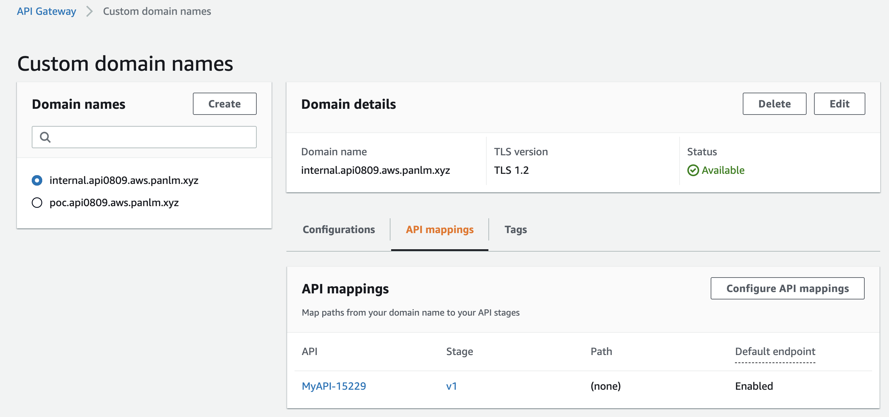
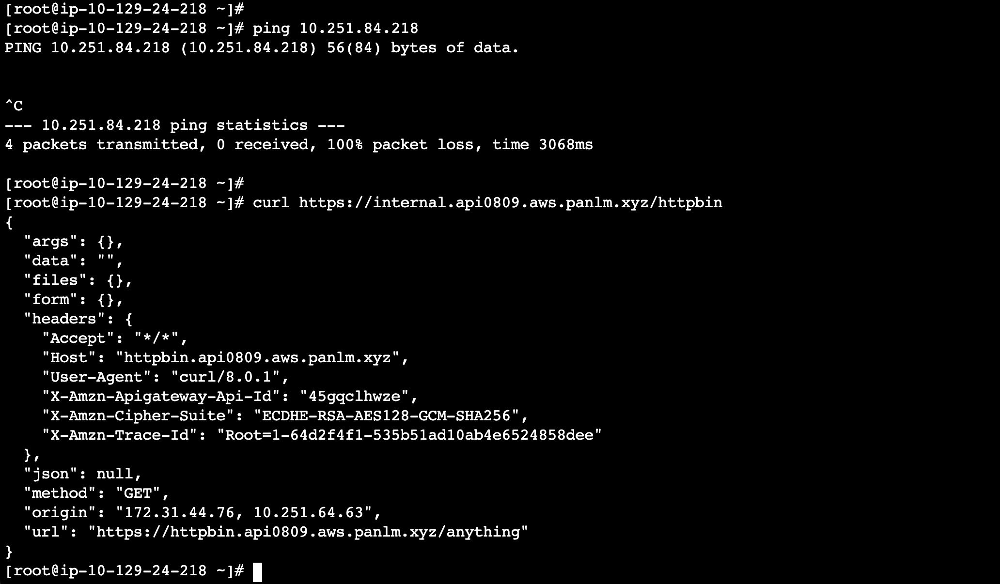
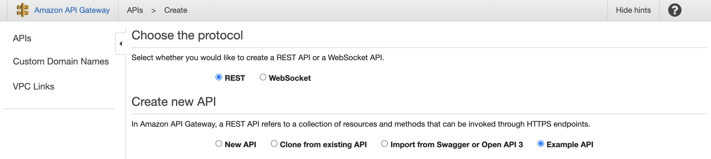
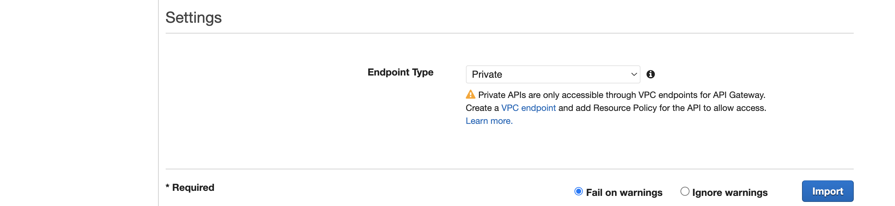
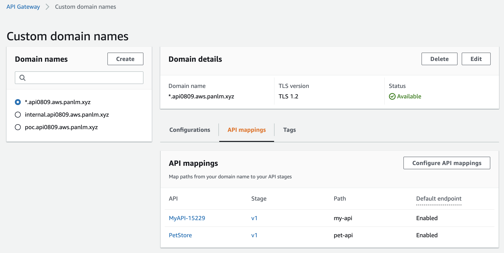
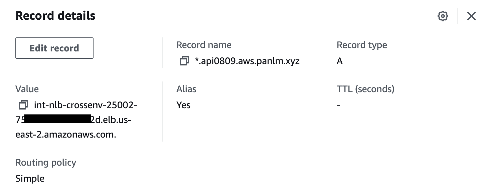
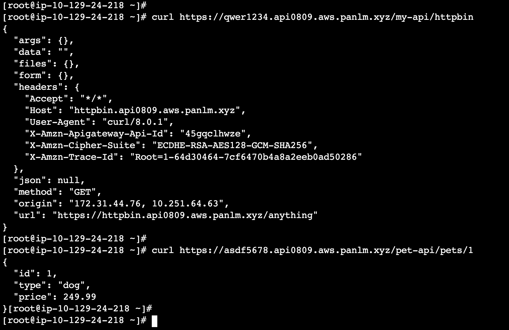

```ad-attention
title: This is a github note

```

# 私有 API 在企业场景中的应用——跨环境访问

- [架构描述](#%E6%9E%B6%E6%9E%84%E6%8F%8F%E8%BF%B0)
- [搭建实验环境](#%E6%90%AD%E5%BB%BA%E5%AE%9E%E9%AA%8C%E7%8E%AF%E5%A2%83)
	- [开始之前](#%E5%BC%80%E5%A7%8B%E4%B9%8B%E5%89%8D)
	- [配置 VPC 互通](#%E9%85%8D%E7%BD%AE-vpc-%E4%BA%92%E9%80%9A)
	- [在 Cloud9 VPC 中创建跨环境负载均衡 CrossENV NLB](#%E5%9C%A8-cloud9-vpc-%E4%B8%AD%E5%88%9B%E5%BB%BA%E8%B7%A8%E7%8E%AF%E5%A2%83%E8%B4%9F%E8%BD%BD%E5%9D%87%E8%A1%A1-crossenv-nlb)
	- [配置内网域名](#%E9%85%8D%E7%BD%AE%E5%86%85%E7%BD%91%E5%9F%9F%E5%90%8D)
	- [配置自定义域名映射](#%E9%85%8D%E7%BD%AE%E8%87%AA%E5%AE%9A%E4%B9%89%E5%9F%9F%E5%90%8D%E6%98%A0%E5%B0%84)
	- [跨环境访问](#%E8%B7%A8%E7%8E%AF%E5%A2%83%E8%AE%BF%E9%97%AE)
	- [使用包含通配符的域名访问](#%E4%BD%BF%E7%94%A8%E5%8C%85%E5%90%AB%E9%80%9A%E9%85%8D%E7%AC%A6%E7%9A%84%E5%9F%9F%E5%90%8D%E8%AE%BF%E9%97%AE)
- [结论](#%E7%BB%93%E8%AE%BA)
- [参考资料](#%E5%8F%82%E8%80%83%E8%B5%84%E6%96%99)


## 架构描述

在企业用户场景中普遍采用多账号的设计（详见[白皮书](https://docs.aws.amazon.com/whitepapers/latest/organizing-your-aws-environment/organizing-your-aws-environment.html)）。最基本的是区分生产账号和非生产账号，在非生产账号中一般使用 VPC 分割不同的环境，例如，开发、测试、预生产等环境使用各自单独的 VPC 进行隔离。另外常见使用共享服务账号，一般是运行一些特定的应用，例如 CICD 应用需要和各个环境进行访问；或者过滤 Ingress 流量的 WAF 组件等。然后使用 AWS 网络组件，例如 Transit Gateway，将共享服务账号下的 VPC 与其他环境中的 VPC 互通。 这样既保证了各个环境的相对独立性，又便于共享服务的访问。

基于此前一篇[博文](TC-private-apigw-dataflow.md)中描述，越来越多的客户在其应用云原生改造中大量使用 Amazon API Gateway 托管服务替换现有应用架构中的第三方 API 网关产品。并且可以在 VPC 中直接使用 API Gateway Endpoint 将流量发送到 API Gateway。对于从外部进入的请求（下图中按照 1-2-3-4-5 的数据流），可以直接从源 VPC (Ingress VPC) 的 API Gateway Endpoint 进入 AWS 托管服务的骨干网络，达到 API Gateway，再通过 VPC Link 直接注入到目标 VPC (APP VPC) 中。

在企业实际使用中会延伸出更多复杂场景，例如，存在跨环境的相互访问时，这样的数据流会有潜在的问题，尤其是在非生产账号下，分散在各自 VPC 中的 Endpoint 无法统一管理，增加了额外的运维负担。从安全角度出发，为了便于统一管控、集中审计和一致的合规性保证，建议在非生产账号下使用 Ingress VPC 中的 API Gateway Endpoint 作为统一入口。并且在该账号下统一配置 Route53 服务作为内网域名解析。

另外，在企业内部使用私有 API 同时绑定内部域名访问时，请求不能直接转发到 API Gateway Endpoint 上，因为会遇到证书验证的问题。需要在 API Gateway Endpoint 之前添加网络负载均衡 (NLB) 或者应用负载均衡 (ALB) 作为内部域名证书卸载使用。

为了简化本篇实验，我们将上述场景中共享服务账号和非生产账号合并为下图中的单一账号。以图中 TGW 为中线，左侧 VPC 更偏向共享服务账号所承担的角色功能；右侧多个 VPC 更偏向非生产账号所承担的角色功能，同时代表各自不同环境，例如开发、测试、预生产等。 TGW 组件上的绿色线条表示路由可达，红色线条表示路由不可达，意味着共享服务 VPC 到各个环境都是路由可达，各个环境之间是路由不可达。


本篇实验完成后，我们将使用内部域名实现跨环境数据流访问（上图紫红色线条）。

- A: APP-2 VPC 中的应用需要跨环境访问 APP-1 VPC 中的应用。内部域名将被解析到 Ingress VPC 中的 CrossENV NLB/ALB 上；
- B: CrossENV NLB/ALB 上将承担内部域名的证书的 TLS 卸载，并且将请求通过 Endpoint 转发到 API Gateway；
- C: 使用 Custom Domain Name 映射内部域名和私有 API 的 Stage 之间的关系后，请求将被转发到正确的私有 API 上；
- D: 然后通过 VPC Link 转发到目标 VPC 中的应用上；

在本篇实验的最后部分，我们将使用包含通配符的域名访问私有 API，并且给出基于路径转发到不同 API 的示例。

## 搭建实验环境

### 开始之前

在开始本篇实验之前，需要完成前一篇[博文](TC-private-apigw-dataflow.md)，创建 Ingress VPC 和 APP VPC （为了便于区分，前一篇 Blog 中 APP VPC 在本篇中描述为 APP-1 VPC）。本篇博文所涉及到的代码可以从 [Github](https://github.com/panlm/blog-private-api-gateway-dataflow) 获取到最新版本。本篇实验完成后将包含下列资源：

- Ingress VPC - 使用所在区域中的默认 VPC
	- Cloud9 - 交互实验环境
	- Elastic Load Balancer - External ALB 用于接收外部请求
	- VPC Endpoint -  用于私有 API 
	- （可选）WAF - 创建 EC2，使用 Nginx 模拟 WAF，参考 [Blog](fake-waf-on-ec2-forwarding-https.md) 
	- （新建）CrossENV NLB - 专用于跨环境访问
- APP-1 VPC - 创建 EKS 集群时自动创建
	- EKS Cluster - 后端应用运行
	- Elastic Load Balancer - Internal ALB 用于应用 Ingress 
	- Elastic Load Balancer - Internal NLB 用于 VPC Link
- （新建）APP-2 VPC 
	- （新建）EC2 - 用于跨环境测试， 使用内部域名访问 Private API
- （新建）TGW (Transit Gateway) - 互联上述 3 个 VPC ，并实现：
	- （新建）路由可达 - Ingress VPC <---> APP-1 VPC 
	- （新建）路由可达 - Ingress VPC <---> APP-2 VPC 
	- （新建）路由不可达 - APP-1 VPC <-X-> APP-2 VPC 
- 其他资源
	- Private API - 请求将转发到下游 APP VPC 中的应用
	- Route53 Hosted Zone - 实验环境的 DNS
	- Amazon Certificate Manager - 实验环境所需证书 
	- CloudWatch Logs - 用于收集 API Gateway 的 Access Log

### 配置 VPC 互通

- 创建实验用的 Cloud9，参考[链接](https://github.com/panlm/panlm.github.io/blob/main/content/20-cloud9/quick-setup-cloud9-script.md) 
- 开始配置 VPC 互通
```sh
CLUSTER_NAME=ekscluster1
AWS_REGION=$(curl -s 169.254.169.254/latest/dynamic/instance-identity/document | jq -r '.region')
export AWS_DEFAULT_REGION=${AWS_REGION}
export AWS_PAGER=""

```

- 创建 TGW 
```sh
tmp=$(mktemp)
aws ec2 create-transit-gateway \
--description "My TGW" |tee $tmp.1
TGW_ID=$(cat $tmp.1 |jq -r '.TransitGateway.TransitGatewayId')

watch -g -n 60 aws ec2 describe-transit-gateways \
--transit-gateway-ids $TGW_ID \
--query 'TransitGateways[].State' --output text

```

^yq2usv

- 挂载 Cloud9 所在的 Ingress VPC 到 TGW
```sh
C9_INST_ID=$(curl -s http://169.254.169.254/latest/meta-data/instance-id)
C9_VPC_ID=$(aws ec2 describe-instances \
--instance-ids ${C9_INST_ID} \
--query 'Reservations[0].Instances[0].VpcId' --output text)
C9_CIDR=$(aws ec2 describe-vpcs \
--vpc-ids ${C9_VPC_ID} \
--query Vpcs[].CidrBlock --output text)

VPC_ID=${C9_VPC_ID}
SUBNET_IDS=$(aws ec2 describe-subnets \
--filters "Name=vpc-id,Values=${VPC_ID}" \
--query 'Subnets[].SubnetId' \
--output text |xargs)

aws ec2 create-transit-gateway-vpc-attachment \
--transit-gateway-id ${TGW_ID} \
--vpc-id ${VPC_ID} \
--subnet-ids ${SUBNET_IDS} \
--tag-specifications 'ResourceType=transit-gateway-attachment,Tags=[{Key=Name,Value=att-'"${VPC_ID}"'}]'

```

^x1asti

- 挂载 EKS 所在的 APP-1 VPC 到 TGW
```sh
EKS_VPC_ID=$(aws eks describe-cluster \
--name ${CLUSTER_NAME} \
--query "cluster.resourcesVpcConfig.vpcId" --output text )
EKS_CIDR=$(aws ec2 describe-vpcs \
--vpc-ids ${EKS_VPC_ID} \
--query Vpcs[].CidrBlock --output text)

VPC_ID=${EKS_VPC_ID}
SUBNET_IDS=$(aws ec2 describe-subnets \
--filters "Name=vpc-id,Values=${VPC_ID}" \
--query 'Subnets[?MapPublicIpOnLaunch==`false`].SubnetId' \
--output text |xargs)

aws ec2 create-transit-gateway-vpc-attachment \
--transit-gateway-id ${TGW_ID} \
--vpc-id ${VPC_ID} \
--subnet-ids ${SUBNET_IDS} \
--tag-specifications 'ResourceType=transit-gateway-attachment,Tags=[{Key=Name,Value=att-'"${VPC_ID}"'}]'

# waiting both attachments created successfully
sleep 30

```

- 编辑路由表实现两个 VPC 互通
```sh
(echo $EKS_VPC_ID
echo $C9_CIDR
echo $C9_VPC_ID
echo $EKS_CIDR) |xargs -n 2 |while read VPC_ID TARGET_CIDR ; do

ROUTE_TABLES=($(aws ec2 describe-route-tables \
--filters "Name=vpc-id,Values=${VPC_ID}" \
--query "RouteTables[].RouteTableId" \
--output text))
for i in ${ROUTE_TABLES[@]}; do
  aws ec2 create-route --route-table-id $i \
  --destination-cidr-block ${TARGET_CIDR} \
  --transit-gateway-id ${TGW_ID}
done

done

# if you got error "InvalidTransitGatewayID.NotFound"
# just re-run this code block

```

^lyckqs

- 创建 APP-2 VPC，并且挂载到 TGW (参考 [link](http://aws-labs.panlm.xyz/20-cloud9/create-standard-vpc-for-lab-in-china-region.html))
```sh
UNIQ_STR=$(date +%Y%m%d-%H%M%S)
BUCKET_NAME=$(aws s3 mb s3://panlm-${UNIQ_STR} |awk '{print $2}')

wget -O aws-vpc.template.yaml https://github.com/panlm/panlm.github.io/raw/main/content/100-eks-infra/110-eks-cluster/aws-vpc.template.yaml
aws s3 cp aws-vpc.template.yaml s3://${BUCKET_NAME}/

# first 2 AZs
# separator `\,` is necessary for ParameterValue in cloudformation
TWOAZS=($(aws ec2 describe-availability-zones --query 'AvailabilityZones[].ZoneName' --output text |xargs -n 1 |sed -n '1,2p' |xargs |sed 's/ /\\,/g'))

echo ${TGW_ID}
TGW_ATTACH=true
CREATE_PUB_SUB=false
echo ${CIDR:=10.129}

STACK_NAME=aws-vpc-${CIDR##*.}-${UNIQ_STR}
# global region: amazonaws.com
# china region: amazonaws.com.cn
if [[ ${AWS_REGION%%-*} == "cn" ]]; then
  SUFFIX=".cn"
else
  SUFFIX=""
fi
aws cloudformation create-stack --stack-name ${STACK_NAME} \
  --parameters ParameterKey=AvailabilityZones,ParameterValue="${TWOAZS}" \
  ParameterKey=VPCCIDR,ParameterValue="${CIDR}.0.0/16" \
  ParameterKey=NumberOfAZs,ParameterValue=2 \
  ParameterKey=PublicSubnet1CIDR,ParameterValue="${CIDR}.128.0/24" \
  ParameterKey=PublicSubnet2CIDR,ParameterValue="${CIDR}.129.0/24" \
  ParameterKey=PublicSubnet3CIDR,ParameterValue="${CIDR}.130.0/24" \
  ParameterKey=PublicSubnet4CIDR,ParameterValue="${CIDR}.131.0/24" \
  ParameterKey=PrivateSubnet1ACIDR,ParameterValue="${CIDR}.0.0/19" \
  ParameterKey=PrivateSubnet2ACIDR,ParameterValue="${CIDR}.32.0/19" \
  ParameterKey=PrivateSubnet3ACIDR,ParameterValue="${CIDR}.64.0/19" \
  ParameterKey=PrivateSubnet4ACIDR,ParameterValue="${CIDR}.96.0/19" \
  ParameterKey=CreateTgwSubnets,ParameterValue="true" \
  ParameterKey=TgwSubnet1CIDR,ParameterValue="${CIDR}.132.0/24" \
  ParameterKey=TgwSubnet2CIDR,ParameterValue="${CIDR}.133.0/24" \
  ParameterKey=TgwSubnet3CIDR,ParameterValue="${CIDR}.134.0/24" \
  ParameterKey=TgwSubnet4CIDR,ParameterValue="${CIDR}.135.0/24" \
  ParameterKey=CreateTgwAttachment,ParameterValue="${TGW_ATTACH}" \
  ParameterKey=TransitGatewayId,ParameterValue="${TGW_ID}" \
  ParameterKey=CreatePublicSubnets,ParameterValue="${CREATE_PUB_SUB}" \
  ParameterKey=CreatePrivateSubnets,ParameterValue="true" \
  ParameterKey=CreateNATGateways,ParameterValue="false" \
  --template-url https://${BUCKET_NAME}.s3.${AWS_REGION}.amazonaws.com${SUFFIX}/aws-vpc.template.yaml \
  --region ${AWS_REGION}

# until get CREATE_COMPLETE
while true ; do
  status=$(aws cloudformation --region ${AWS_REGION} describe-stacks --stack-name ${STACK_NAME} --query 'Stacks[0].StackStatus' --output text)
  echo ${status}
  if [[ ${status} == 'CREATE_IN_PROGRESS' ]]; then
    sleep 30
  else
    break
  fi
done

```

- 打通 Ingress VPC 到 APP-2 VPC 的路由
```sh
(echo $C9_VPC_ID
echo "${CIDR}.0.0/16") |xargs -n 2 |while read VPC_ID TARGET_CIDR ; do

ROUTE_TABLES=($(aws ec2 describe-route-tables \
  --filters "Name=vpc-id,Values=${VPC_ID}" \
  --query "RouteTables[].RouteTableId" \
  --output text))
for i in ${ROUTE_TABLES[@]}; do
  aws ec2 create-route --route-table-id $i \
  --destination-cidr-block ${TARGET_CIDR} \
  --transit-gateway-id ${TGW_ID}
done

done

```

### 在 Cloud9 VPC 中创建跨环境负载均衡 CrossENV NLB

- 确保 Hosted Zone 和证书存在
```sh
UNIQ_STR=$RANDOM
PORT443=443
TMP=$(mktemp)
echo ${AWS_DEFAULT_REGION}

# DOMAIN_NAME=$(aws route53 list-hosted-zones-by-name --dns-name panlm.xyz --query HostedZones[].Name --output text |sed 's/\.$//')
echo ${DOMAIN_NAME} # like "api0809.aws.panlm.xyz"

CERTIFICATE_ARN=$(aws acm list-certificates --query "CertificateSummaryList[?DomainName=='*.${DOMAIN_NAME}'].CertificateArn" --output text)
echo ${CERTIFICATE_ARN}

```

- 创建跨环境 CrossENV NLB
```sh
# get cloud9 vpc
C9_INST_ID=$(curl -s http://169.254.169.254/latest/meta-data/instance-id)
C9_VPC_ID=$(aws ec2 describe-instances \
--instance-ids ${C9_INST_ID} \
--query 'Reservations[0].Instances[0].VpcId' --output text)

# get public subnet for external alb
C9_SUBNETS_ID=$(aws ec2 describe-subnets \
--filter "Name=vpc-id,Values=${C9_VPC_ID}" \
--query 'Subnets[?MapPublicIpOnLaunch==`true`].SubnetId' \
--output text)

# create tls-type target group
aws elbv2 create-target-group \
--name int-nlb-crossenv-tg-tls-${UNIQ_STR} \
--protocol TLS \
--port ${PORT443} \
--target-type ip \
--vpc-id ${C9_VPC_ID} |tee $TMP.1
tg_tls_arn=$(cat $TMP.1 |jq -r '.TargetGroups[0].TargetGroupArn')

# create nlb
aws elbv2 create-load-balancer \
--name int-nlb-crossenv-${UNIQ_STR} \
--type network \
--scheme internal \
--subnets ${C9_SUBNETS_ID} |tee $TMP.2
nlb_crossenv_arn=$(cat $TMP.2 |jq -r '.LoadBalancers[0].LoadBalancerArn')
nlb_crossenv_dnsname=$(cat $TMP.2 |jq -r '.LoadBalancers[0].DNSName')

# create listener for nlb
aws elbv2 create-listener \
--load-balancer-arn ${nlb_crossenv_arn} \
--protocol TLS --port ${PORT443}  \
--certificates CertificateArn=${CERTIFICATE_ARN} \
--ssl-policy ELBSecurityPolicy-2016-08 \
--default-actions Type=forward,TargetGroupArn=${tg_tls_arn}

# get endpoint ip 
ENDPOINT_ENI=$(aws ec2 describe-vpc-endpoints \
--query 'VpcEndpoints[?ServiceName==`com.amazonaws.'"${AWS_DEFAULT_REGION}"'.execute-api`].NetworkInterfaceIds[]' --output text)

ENDPOINT_ENI_IP=$(aws ec2 describe-network-interfaces \
--network-interface-ids ${ENDPOINT_ENI} \
--query 'NetworkInterfaces[].PrivateIpAddress' --output text)

# add ip address to nlb's target group
targets=$(for i in ${ENDPOINT_ENI_IP} ; do
  echo "Id=$i"
done |xargs )

aws elbv2 register-targets \
--target-group-arn ${tg_tls_arn} \
--targets ${targets}

```

### 配置内网域名

- 绑定 `internal` 域名到 CrossENV NLB
```sh
INTERNAL_HOSTNAME="internal.${DOMAIN_NAME}"
echo ${nlb_crossenv_dnsname}

envsubst >internal-route53-record.json <<-EOF
{
  "Comment": "UPSERT a record for internal.xxx.com ",
  "Changes": [
    {
      "Action": "UPSERT",
      "ResourceRecordSet": {
        "Name": "${INTERNAL_HOSTNAME}",
        "Type": "CNAME",
        "TTL": 300,
        "ResourceRecords": [
          {
            "Value": "${nlb_crossenv_dnsname}"
          }
        ]
      }
    }
  ]
}
EOF

ZONE_ID=$(aws route53 list-hosted-zones-by-name \
--dns-name "${DOMAIN_NAME}." \
--query HostedZones[0].Id --output text)

aws route53 change-resource-record-sets --hosted-zone-id ${ZONE_ID} --change-batch file://internal-route53-record.json

aws route53 list-resource-record-sets --hosted-zone-id ${ZONE_ID} --query "ResourceRecordSets[?Name == '${INTERNAL_HOSTNAME}.']"

```

### 配置自定义域名映射

- 在 API Gateway 中创建自定义域名 `internal` ，并且选择相应的 ACM 证书
- 配置 API Mapping （如下图）指向现有 API 的 stage v1，Path 为空



### 跨环境访问

- 创建 EC2 实例
	- 使用 Amazon Linux 2 AMI
	- 选择合适的规格例如 m5.large
	- 不需要指定 Key Pair（通过 SSM Session Manager 访问，相关Endpoint 由 Cloudformation 创建）
	 - 在 APP-2 VPC 中 Private Subnet 中（默认为 `10.129.0.0/16`，由 Cloudformation 创建）
- 创建角色分配给 EC2，包含策略 `AmazonSSMManagedInstanceCore`，重启实例，确保可以使用 SSM Session Manager 访问（参考[文档](https://docs.aws.amazon.com/en_us/console/systems-manager/qs-host-management)）
- 从该 EC2 发起请求，访问内网的域名：
```sh
echo curl https://${INTERNAL_HOSTNAME}/httpbin
```



**查看 ICMP 请求的数据流**
- 从 APP-2 VPC 到 APP-1 VPC 的 ICMP 数据流不可访问，路由不可达（提前已配置目标实例的安全组允许 ICMP 流量）

**查看 curl 请求的数据流**
- 从上图 `origin` 字段可以看到完整的请求数据流
	- 第一个地址为 Ingress VPC 中， 跨环境负载均衡（CrossENV NLB）的内网地址；
	- 第二个地址为 APP-1 VPC 中，网络负载均衡（Internal NLB）的内网地址；

### 使用包含通配符的域名访问

接下来我们将扩展下域名相关内容。我们尝试使用通配符将未定义的域名全部转发到 API Gateway，通过在 Custom Domain Name 中的 mapping 进行映射，基于请求的路径将不同的请求转发到不同的私有 API 上。

- 我们先创建一个 Sample 的 API，并确保 Endpoint 类型为 **私有**



- 私有 API 在 Deploy 之前需要配置 Resource Policy，直接使用下面代码。注意修改 vpce-id 为你环境中 Ingress VPC 中的 API Gateway Endpoint，为了方便，参考已有的 API 的 Resource Policy 中的 vpce-id
```json
{
  "Version": "2012-10-17",
  "Statement": [
    {
      "Effect": "Deny",
      "Principal": "*",
      "Action": "execute-api:Invoke",
      "Resource": "execute-api:/*/*/*",
      "Condition": {
        "StringNotEquals": {
          "aws:sourceVpce": ["vpce-093cxxxx0ee8"]
        }
      }
    },
    {
      "Effect": "Allow",
      "Principal": "*",
      "Action": "execute-api:Invoke",
      "Resource": "execute-api:/*/*/*"
    }
  ]
}
```

- Deploy API 时，新 Stage 名称为 v1
- 创建一个新的 Customer Domain Name 为 `*.api0809.aws.panlm.xyz`
	- 注意我们使用不同 Path 对应不同的 API Stage


-  然后我们需要添加一条新记录到 Route53 中，确保所有子域名请求都转发到 CrossENV NLB 上 （wildcard DNS record）


- 接下来我们从 EC2 上进行验证
	- 请求访问随机 子域名 加 my-api 前缀
	- 请求访问随机 子域名 加 pet-api 前缀



## 结论

基于企业客户的安全指南，不同环境之间是应该相互独立，不允许互访，如果有需要访问的，应该显式的（explicited）使用 Ingress VPC 作为中转，方便安全团队监管和确保合规性。本篇中实现了使用私有 API 同时绑定内部域名访问时，如何符合这一安全要求。确保使用 API Gateway 替换原有架构中第三方 API 网关产品后，整个架构的可延续性和安全合规性。


## 参考资料

- https://github.com/aws-samples/serverless-samples/tree/main/apigw-private-custom-domain-name


