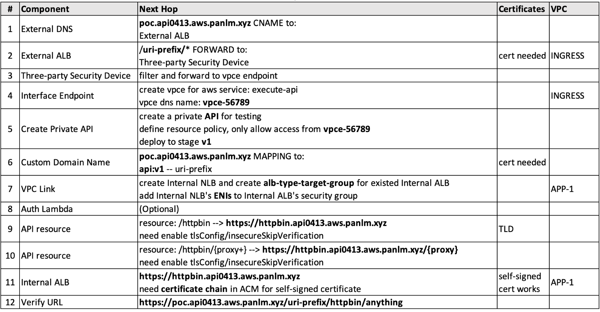

```ad-attention
title: This is a github note

```

# Private API Scenarios in Enterprise Customers

- [Foreword](#foreword)
- [Architectural description](#architectural-description)
- [Set up your lab environment](#set-up-your-lab-environment)
	- [Prepare Environment](#prepare-environment)
		- [Prepare AWS Cloud9 Environment](#prepare-aws-cloud9-environment)
		- [Create EKS Cluster](#create-eks-cluster)
		- [Install AWS Load Balancer Controller](#install-aws-load-balancer-controller)
		- [Install ExternalDNS](#install-externaldns)
		- [Create Hosted Zone](#create-hosted-zone)
		- [Create Certificates](#create-certificates)
		- [Verify environment is ready](#verify-environment-is-ready)
	- [Backend Applications](#backend-applications)
	- [API Gateway](#api-gateway)
		- [Step 1-2](#step-1-2)
		- [Step 4](#step-4)
		- [Step 5-7](#step-5-7)
		- [Step 9-10](#step-9-10)
		- [Step 12](#step-12)
- [Conclusion](#conclusion)
- [References](#references)


## Foreword

Amazon API Gateway is a managed service that helps developers easily create, publish, maintain, monitor, and secure APIs of any scale. More and more customers are using Amazon API Gateway services to replace third-party API gateway products in existed application architectures during their application cloud native transformation (building new applications or transforming old applications) to achieve values such as reducing maintenance costs, using pay-as-you-go to increase the input-output ratio, and making full use of the elastic scalability of the cloud to meet business peaks. Using managed services to replace existing components is not plug and play directly, but requires additional considerations such as the enterprise's existing security policies and network architecture, including how to ensure that traffic always remains within the VPC or within the trusted network of AWS; how to interact with other existing components to ensure the continuity of the architecture; and how to control access to meet enterprise security compliance requirements.

## Architectural description

Third-party security devices are adopted widely in enterprise customers, and the centralized Ingress ELB Sandwich architecture is adopted commonly as well (see [blog](https://aws.amazon.com/blogs/networking-and-content-delivery/design-your-firewall-deployment-for-internet-ingress-traffic-flows/)). In this typical architecture, we deep dive the data flow when using Amazon API Gateway to replace the third-party API gateway products.

Let's first take a look at the data flow when using a third-party API gateway product in this architecture (green numbers in the image below):
- 1: External Application Load Balancer (External ALB), based on the principle of minimum exposure, exposes the APIs that required to be access by external from internet;
- 2: Third-party security equipment, all traffic will go through it for traffic filtering and protection within the enterprise;
- 3: The filtered traffic will be forwarded to a third-party API gateway product, and then complete authentication and authorization, then requests will be keep forwarding;
- 4: Request access to Internal Application Load Balancer (Internal ALB) and access to application finally;

Architectural notes:
- Using an independent Ingress VPC can achieve architectural scalability better. Multiple App VPCs can exist at the same time, and be independent each other, they could be attached to TGW to achieve north-south traffic control;
- When expanding to multi-account scenarios, Ingress VPC can be placed in a separate security account. App VPC and API Gateway can be placed in the application account. it makes management permission boundaries more clear;


Amazon API Gateway could be exposed to Internet directly without any load balancer in front of it, and it could be protected by AWS Web Application Firewall (WAF) for filtering and throttling, but the reason of using third-party security devices in this architecture is that it complies with the company's overall security policy and can make full use existing security equipment without additional investment. It also provides more advantages, including: achieving application transformation gradually, reduced management costs, flexible expansion, etc.

Let's take a look at the data flow when using Amazon API Gateway (marked with red numbers in the image above):
- 1: Keep the external exposure unchanged, the traffic from External ALB is filtered by security equipment, and then access the VPC endpoint of API Gateway;
- 2: After the traffic enters the VPC endpoint, it will be processed by API Gateway. At this time, although the traffic has left the customer's VPC, it remains within the AWS trusted network;
- 3: All requests need to be authenticated and authorized before being forwarded to downstream applications. This is generally achieved using Lambda Authorizer. For example, verify the access token included in the request is valid;
- 4: After authentication and authorization, the request will access the application service in the customer VPC through VPC Link. Using VPC Link can ensure that the traffic enters the user's VPC directly without go through to the Internet;
- 5: The application is published on Internal Application Load Balancer (Internal ALB), the VPC Link for Rest API supports forwarding requests to internal application load balancer through Network Load Balancer (NLB) to access application finally;

Architectural notes:
- We can see, the original cross VPC traffic will pass through the Amazon Transit Gateway (TGW). After using API Gateway, the traffic will be transferred within the AWS trusted network, and the original TGW components will no longer be required;
- Network Load Balancer has been added to the architecture, but it will not become bottlenecks, because Network Load Balancer is a layer 4 forwarding, see [blog](https://aws.amazon.com/blogs/compute/understanding-vpc-links-in-amazon-api-gateway-private-integrations/) for details;

This article verifies the following:
- Use a private type API in Amazon API Gateway to replace the original third-party API Gateway product;
- All certificates is valid in each components on this data flow, and the application services published on Internal ALB can use self-signed certificates;
- Based on corporate security compliance, data traffic needs to always be transmitted within the customer's VPC and within the AWS trusted network without transmission to the Internal accidentally;
- Passing headers to downstream applications for comsumption, and customizing the Access Log with specific headers.
- WAF does not include in this lab, reference [here](fake-waf-on-ec2-forwarding-https.md) for configuration

## Set up your lab environment

The latest version of the code covered in this article can be obtained from [Github](https://github.com/panlm/blog-private-api-gateway-dataflow). After completing this section, you will create the following resources:
- Ingress VPC - Use your default VPC in your region
	- Cloud9 - Interactive experimental environment
	- Elastic Load Balancer - External ALB for receiving external requests
	- VPC Endpoint - for private APIs
- App VPC - created automatically when the EKS cluster is created
	- EKS Cluster - Backend application runs on it
	- Elastic Load Balancer - Internal ALB for Ingress
	- Elastic Load Balancer - Internal NLB for VPC Link
- Additional Resources
	- Route53 Hosted Zone - DNS
	- Amazon Certificate Manager - Certificates required in this article
	- CloudWatch Logs - Used to collect API Gateway Access Logs

### Prepare Environment

This article uses an AWS Global account to set up in region us-east-2. Follow these steps to create the relevant resources.

#### Prepare AWS Cloud9 Environment
([link](http://aws-labs.panlm.xyz/20-cloud9/setup-cloud9-for-eks.html))

-  open [link](https://console.aws.amazon.com/cloudshell) cloudshell, and then execute following code to create cloud9 environment
```sh
# name=<give your cloud9 a name>
datestring=$(date +%Y%m%d-%H%M)
echo ${name:=cloud9-$datestring}

# VPC_ID=<your vpc id> 
# ensure you have public subnet in it
DEFAULT_VPC_ID=$(aws ec2 describe-vpcs \
  --filter Name=is-default,Values=true \
  --query 'Vpcs[0].VpcId' --output text \
  --region ${AWS_DEFAULT_REGION})
VPC_ID=${VPC_ID:=$DEFAULT_VPC_ID}

if [[ ! -z ${VPC_ID} ]]; then
  FIRST_SUBNET=$(aws ec2 describe-subnets \
    --filters "Name=vpc-id,Values=${VPC_ID}" \
    --query 'Subnets[?(AvailabilityZone==`'"${AWS_DEFAULT_REGION}a"'` && MapPublicIpOnLaunch==`true`)].SubnetId' \
    --output text \
    --region ${AWS_DEFAULT_REGION})
  aws cloud9 create-environment-ec2 \
    --name ${name} \
    --image-id amazonlinux-2-x86_64 \
    --instance-type m5.large \
    --subnet-id ${FIRST_SUBNET%% *} \
    --automatic-stop-time-minutes 10080 \
    --region ${AWS_DEFAULT_REGION} |tee /tmp/$$
  echo "Open URL to access your Cloud9 Environment:"
  C9_ID=$(cat /tmp/$$ |jq -r '.environmentId')
  echo "https://${AWS_DEFAULT_REGION}.console.aws.amazon.com/cloud9/ide/${C9_ID}"
else
  echo "you have no default vpc in $AWS_DEFAULT_REGION"
fi

```
- click the URL at the bottom to open cloud9 environment

- execute this code block to install tools for your lab, and resize ebs of cloud9 ([link](https://docs.aws.amazon.com/cloud9/latest/user-guide/move-environment.html#move-environment-resize))
```sh
# set size as your expectation, otherwize 100g as default volume size
# size=200

# install others
sudo yum -y install jq gettext bash-completion moreutils wget

# install awscli
curl "https://awscli.amazonaws.com/awscli-exe-linux-x86_64.zip" -o "awscliv2.zip"
echo A |unzip awscliv2.zip
sudo ./aws/install --update
echo "complete -C '/usr/local/bin/aws_completer' aws" >> ~/.bash_profile

# remove existed aws
if [[ $? -eq 0 ]]; then
  sudo yum remove -y awscli
  source ~/.bash_profile
  aws --version
fi

# install ssm session plugin
curl "https://s3.amazonaws.com/session-manager-downloads/plugin/latest/linux_64bit/session-manager-plugin.rpm" -o "session-manager-plugin.rpm"
sudo yum install -y session-manager-plugin.rpm

# your default region 
export AWS_DEFAULT_REGION=$(curl -s 169.254.169.254/latest/dynamic/instance-identity/document | jq -r '.region')

if [[ -c /dev/nvme0 ]]; then
  wget -qO- https://github.com/amazonlinux/amazon-ec2-utils/raw/main/ebsnvme-id >/tmp/ebsnvme-id
  VOLUME_ID=$(sudo python3 /tmp/ebsnvme-id -v /dev/nvme0 |awk '{print $NF}')
  DEVICE_NAME=/dev/nvme0n1
else
  C9_INST_ID=$(curl 169.254.169.254/latest/meta-data/instance-id)
  VOLUME_ID=$(aws ec2 describe-volumes --filters Name=attachment.instance-id,Values=${C9_INST_ID} --query "Volumes[0].VolumeId" --output text)
  DEVICE_NAME=/dev/xvda
fi

aws ec2 modify-volume --volume-id ${VOLUME_ID} --size ${size:-100}
sleep 10
sudo growpart ${DEVICE_NAME} 1
sudo xfs_growfs -d /

if [[ $? -eq 1 ]]; then
  ROOT_PART=$(df |grep -w / |awk '{print $1}')
  sudo resize2fs ${ROOT_PART}
fi

```

- install some eks related tools
```sh
# install kubectl with +/- 1 cluster version 1.23.15 / 1.22.17 / 1.24.15 / 1.25.11
# refer: https://kubernetes.io/releases/
# sudo curl --location -o /usr/local/bin/kubectl "https://dl.k8s.io/release/$(curl -L -s https://dl.k8s.io/release/stable.txt)/bin/linux/amd64/kubectl"
sudo curl --silent --location -o /usr/local/bin/kubectl "https://storage.googleapis.com/kubernetes-release/release/v1.25.11/bin/linux/amd64/kubectl"

# 1.22.x version of kubectl
# sudo curl --silent --location -o /usr/local/bin/kubectl "https://storage.googleapis.com/kubernetes-release/release/v1.22.11/bin/linux/amd64/kubectl"

sudo chmod +x /usr/local/bin/kubectl

kubectl completion bash >>  ~/.bash_completion
. /etc/profile.d/bash_completion.sh
. ~/.bash_completion
alias k=kubectl 
complete -F __start_kubectl k
echo "alias k=kubectl" >> ~/.bashrc
echo "complete -F __start_kubectl k" >> ~/.bashrc

# install eksctl
# consider install eksctl version 0.89.0
# if you have older version yaml 
# https://eksctl.io/announcements/nodegroup-override-announcement/
curl --location "https://github.com/weaveworks/eksctl/releases/latest/download/eksctl_$(uname -s)_amd64.tar.gz" | tar xz -C /tmp
sudo mv -v /tmp/eksctl /usr/local/bin
eksctl completion bash >> ~/.bash_completion
. /etc/profile.d/bash_completion.sh
. ~/.bash_completion

# helm newest version (3.10.3)
curl -sSL https://raw.githubusercontent.com/helm/helm/master/scripts/get-helm-3 | bash
# helm 3.8.2 (helm 3.9.0 will have issue #10975)
# wget https://get.helm.sh/helm-v3.8.2-linux-amd64.tar.gz
# tar xf helm-v3.8.2-linux-amd64.tar.gz
# sudo mv linux-amd64/helm /usr/local/bin/helm
helm version --short

# install aws-iam-authenticator 0.5.12 
wget -O aws-iam-authenticator https://github.com/kubernetes-sigs/aws-iam-authenticator/releases/download/v0.5.12/aws-iam-authenticator_0.5.12_linux_amd64
chmod +x ./aws-iam-authenticator
sudo mv ./aws-iam-authenticator /usr/local/bin/

# install kube-no-trouble
sh -c "$(curl -sSL https://git.io/install-kubent)"

# install kubectl convert plugin
curl -LO "https://dl.k8s.io/release/$(curl -L -s https://dl.k8s.io/release/stable.txt)/bin/linux/amd64/kubectl-convert"
curl -LO "https://dl.k8s.io/$(curl -L -s https://dl.k8s.io/release/stable.txt)/bin/linux/amd64/kubectl-convert.sha256"
echo "$(cat kubectl-convert.sha256) kubectl-convert" | sha256sum --check
sudo install -o root -g root -m 0755 kubectl-convert /usr/local/bin/kubectl-convert
rm kubectl-convert kubectl-convert.sha256

# option install jwt-cli
# https://github.com/mike-engel/jwt-cli/blob/main/README.md
# sudo yum -y install cargo
# cargo install jwt-cli
# sudo ln -sf ~/.cargo/bin/jwt /usr/local/bin/jwt

# install flux & fluxctl
curl -s https://fluxcd.io/install.sh | sudo -E bash
flux -v
. <(flux completion bash)

# sudo wget -O /usr/local/bin/fluxctl $(curl https://api.github.com/repos/fluxcd/flux/releases/latest | jq -r ".assets[] | select(.name | test(\"linux_amd64\")) | .browser_download_url")
# sudo chmod 755 /usr/local/bin/fluxctl
# fluxctl version
# fluxctl identity --k8s-fwd-ns flux

```

- 直接执行下面代码块可能遇到权限不够的告警，需要：
	- 如果你有 workshop 的 Credentials ，直接先复制粘贴到命令行，再执行下列步骤；(copy and paste your workshop's credential to CLI and then execute this code block)
	- 或者，如果自己账号的 cloud9，先用环境变量方式（`AWS_ACCESS_KEY_ID` 和 `AWS_SECRET_ACCESS_KEY`）保证有足够权限执行 (or using environment variables to export credential yourself)
	- 下面代码块包括：
		- 禁用 cloud9 中的 credential 管理，从 `~/.aws/credentials` 中删除 `aws_session_token=` 行
		- 分配管理员权限 role 到 cloud9 instance
```sh
aws cloud9 update-environment  --environment-id $C9_PID --managed-credentials-action DISABLE
rm -vf ${HOME}/.aws/credentials

# ---
export AWS_PAGER=""
export AWS_DEFAULT_REGION=$(curl -s 169.254.169.254/latest/dynamic/instance-identity/document | jq -r '.region')
C9_INST_ID=$(curl 169.254.169.254/latest/meta-data/instance-id)
ROLE_NAME=adminrole-$RANDOM
MY_ACCOUNT_ID=$(aws sts get-caller-identity --query Account --output text)

cat > ec2.json <<-EOF
{
    "Effect": "Allow",
    "Principal": {
        "Service": "ec2.amazonaws.com"
    },
    "Action": "sts:AssumeRole"
}
EOF
STATEMENT_LIST=ec2.json

for i in WSParticipantRole WSOpsRole TeamRole OpsRole ; do
  aws iam get-role --role-name $i >/dev/null 2>&1
  if [[ $? -eq 0 ]]; then
    envsubst >$i.json <<-EOF
{
  "Effect": "Allow",
  "Principal": {
    "AWS": "arn:aws:iam::${MY_ACCOUNT_ID}:role/$i"
  },
  "Action": "sts:AssumeRole"
}
EOF
    STATEMENT_LIST=$(echo ${STATEMENT_LIST} "$i.json")
  fi
done

jq -n '{Version: "2012-10-17", Statement: [inputs]}' ${STATEMENT_LIST} > trust.json
echo ${STATEMENT_LIST}
rm -f ${STATEMENT_LIST}

# create role
aws iam create-role --role-name ${ROLE_NAME} \
  --assume-role-policy-document file://trust.json
aws iam attach-role-policy --role-name ${ROLE_NAME} \
  --policy-arn "arn:aws:iam::aws:policy/AdministratorAccess"

instance_profile_arn=$(aws ec2 describe-iam-instance-profile-associations \
  --filter Name=instance-id,Values=$C9_INST_ID \
  --query IamInstanceProfileAssociations[0].IamInstanceProfile.Arn \
  --output text)
if [[ ${instance_profile_arn} == "None" ]]; then
  # create one
  aws iam create-instance-profile \
    --instance-profile-name ${ROLE_NAME}
  sleep 10
  # attach role to it
  aws iam add-role-to-instance-profile \
    --instance-profile-name ${ROLE_NAME} \
    --role-name ${ROLE_NAME}
  sleep 10
  # attach instance profile to ec2
  aws ec2 associate-iam-instance-profile \
    --iam-instance-profile Name=${ROLE_NAME} \
    --instance-id ${C9_INST_ID}
else
  existed_role_name=$(aws iam get-instance-profile \
    --instance-profile-name ${instance_profile_arn##*/} \
    --query 'InstanceProfile.Roles[0].RoleName' \
    --output text)
  aws iam attach-role-policy --role-name ${existed_role_name} \
    --policy-arn "arn:aws:iam::aws:policy/AdministratorAccess"
fi

```

- 在 cloud9 中，重新打开一个 terminal 窗口，并验证权限符合预期。上面代码块将创建一个 instance profile ，并将关联名为 `adminrole-xxx` 的 role，或者在 cloud9 现有的 role 上关联 `AdministratorAccess` role policy。(open new tab to verify you have new role, `adminrole-xxx`, on your cloud9)
```sh
aws sts get-caller-identity
```

#### Create EKS Cluster

Create EKS Cluster，Called `ekscluster1` ([link](http://aws-labs.panlm.xyz/100-eks-infra/110-eks-cluster/eks-public-access-cluster.html#create-eks-cluster))

- create eks cluster in this region
```sh
export AWS_PAGER=""
export AWS_DEFAULT_REGION=$(curl -s 169.254.169.254/latest/dynamic/instance-identity/document | jq -r '.region')
export AWS_REGION=${AWS_DEFAULT_REGION}

export CLUSTER_NAME=ekscluster1
export EKS_VERSION=1.25
CLUSTER_NUM=$(eksctl get cluster |wc -l)
export CIDR="10.25${CLUSTER_NUM}.0.0/16"

```

- 执行下面代码创建配置文件 (create yaml file for eks cluster creation)
	- 注意集群名称 (ensure cluster name is correct)
	- 注意使用的 AZ 符合你所在的区域 (ensure AZs are correct)
```sh
AZS=($(aws ec2 describe-availability-zones \
--query 'AvailabilityZones[].ZoneName' --output text |awk '{print $1,$2}'))
export AZ0=${AZS[0]}
export AZ1=${AZS[1]}

cat >$$.yaml <<-'EOF'
---
apiVersion: eksctl.io/v1alpha5
kind: ClusterConfig

metadata:
  name: "${CLUSTER_NAME}"
  region: "${AWS_REGION}"
  version: "${EKS_VERSION}"

availabilityZones: ["${AZ0}", "${AZ1}"]

vpc:
  cidr: "${CIDR}"
  clusterEndpoints:
    privateAccess: true
    publicAccess: true

cloudWatch:
  clusterLogging:
    enableTypes: ["*"]

# secretsEncryption:
#   keyARN: ${MASTER_ARN}

managedNodeGroups:
- name: managed-ng
  minSize: 2
  maxSize: 5
  desiredCapacity: 2
  instanceType: m5.large
  ssh:
    enableSsm: true
  privateNetworking: true

addons:
- name: vpc-cni 
  version: latest
- name: coredns
  version: latest 
- name: kube-proxy
  version: latest

iam:
  withOIDC: true
  serviceAccounts:
  - metadata:
      name: aws-load-balancer-controller
      namespace: kube-system
    wellKnownPolicies:
      awsLoadBalancerController: true
  - metadata:
      name: ebs-csi-controller-sa
      namespace: kube-system
    wellKnownPolicies:
      ebsCSIController: true
  - metadata:
      name: efs-csi-controller-sa
      namespace: kube-system
    wellKnownPolicies:
      efsCSIController: true
  - metadata:
      name: cloudwatch-agent
      namespace: amazon-cloudwatch
    attachPolicyARNs:
    - "arn:aws:iam::aws:policy/CloudWatchAgentServerPolicy"
  - metadata:
      name: fluent-bit
      namespace: amazon-cloudwatch
    attachPolicyARNs:
    - "arn:aws:iam::aws:policy/CloudWatchAgentServerPolicy"
EOF
cat $$.yaml |envsubst '$CLUSTER_NAME $AWS_REGION $AZ0 $AZ1 $EKS_VERSION $CIDR ' > cluster-${CLUSTER_NAME}.yaml

```

- 创建集群，预计需要 20 分钟 (wait cluster create successfully, about 20 mins)
```sh
eksctl create cluster -f cluster-${CLUSTER_NAME}.yaml

```

#### Install AWS Load Balancer Controller 
([link](http://aws-labs.panlm.xyz/100-eks-infra/130-eks-network/aws-load-balancer-controller.html#install-))

- Install AWS Load Balancer Controller
```sh
echo ${CLUSTER_NAME}
echo ${AWS_REGION}
echo ${AWS_DEFAULT_REGION}
export AWS_PAGER=""

eksctl utils associate-iam-oidc-provider \
  --cluster ${CLUSTER_NAME} \
  --approve

# curl -o iam_policy.json https://raw.githubusercontent.com/kubernetes-sigs/aws-load-balancer-controller/v2.4.1/docs/install/iam_policy.json
git clone https://github.com/kubernetes-sigs/aws-load-balancer-controller.git

# check iamserviceaccount has been create by eksctl
aws cloudformation describe-stacks --stack-name eksctl-${CLUSTER_NAME}-addon-iamserviceaccount-kube-system-aws-load-balancer-controller 2>&1 1>/dev/null
if [[ $? -ne 0 ]]; then

if [[ ${AWS_REGION%%-*} == "cn" ]]; then 
  # aws china region
  IAM_POLICY_TEMPLATE=iam_policy_cn.json 
else
  # aws commercial region
  IAM_POLICY_TEMPLATE=iam_policy.json 
fi
cp aws-load-balancer-controller/docs/install/${IAM_POLICY_TEMPLATE} .

policy_name=AWSLoadBalancerControllerIAMPolicy-`date +%m%d%H%M`
policy_arn=$(aws iam create-policy \
  --policy-name ${policy_name}  \
  --policy-document file://${IAM_POLICY_TEMPLATE} \
  --query 'Policy.Arn' \
  --output text)

eksctl create iamserviceaccount \
  --cluster=${CLUSTER_NAME} \
  --namespace=kube-system \
  --name=aws-load-balancer-controller \
  --role-name=${policy_name} \
  --attach-policy-arn=${policy_arn} \
  --override-existing-serviceaccounts \
  --approve

# check iamserviceaccount has been create by eksctl
fi

helm repo add eks https://aws.github.io/eks-charts
helm repo update

# following helm cmd will fail if you use 3.9.0 version
# downgrade to helm 3.8.2
# and another solved issue is here: [[ingress-controller-lab-issue]]
if [[ ${AWS_REGION%%-*} == "cn" ]]; then 
  # aws china region
  helm upgrade -i aws-load-balancer-controller eks/aws-load-balancer-controller \
	-n kube-system \
	--set clusterName=${CLUSTER_NAME} \
	--set serviceAccount.create=false \
	--set serviceAccount.name=aws-load-balancer-controller \
	--set image.repository=961992271922.dkr.ecr.cn-northwest-1.amazonaws.com.cn/amazon/aws-load-balancer-controller \
	# --set region=${AWS_DEFAULT_REGION} \
	# --set vpcId=${VPC_ID} 
else
  # aws commercial region
  helm install aws-load-balancer-controller eks/aws-load-balancer-controller \
	-n kube-system \
	--set clusterName=${CLUSTER_NAME} \
	--set serviceAccount.create=false \
	--set serviceAccount.name=aws-load-balancer-controller 
fi

kubectl get deployment -n kube-system aws-load-balancer-controller

```

#### Install ExternalDNS 
([link](http://aws-labs.panlm.xyz/100-eks-infra/130-eks-network/externaldns-for-route53.html#install-))

- 创建所需要的服务账号 (create service account in cluster)
	- 确保 EKS 集群名称正确 (ensure cluster name is correct)
	- 确保使用正确的 Region  (ensure region is correct)
	- 确保上游域名已存在，本例中将创建 `api0413.aws.panlm.xyz` 域名，因此确保 `aws.panlm.xyz` 已存在 (ensure upstream domain registrar is existed. In this blog, we will create `api0413.aws.panlm.xyz` hosted zone, you need ensure `aws.panlm.xyz` is existed)
```sh
echo ${CLUSTER_NAME}
echo ${AWS_REGION}
DOMAIN_NAME=api0413.aws.panlm.xyz
EXTERNALDNS_NS=externaldns
export AWS_PAGER=""

# create namespace if it does not yet exist
kubectl get namespaces | grep -q $EXTERNALDNS_NS || \
  kubectl create namespace $EXTERNALDNS_NS

cat >externaldns-policy.json <<-EOF
{
  "Version": "2012-10-17",
  "Statement": [
    {
      "Effect": "Allow",
      "Action": [
        "route53:ChangeResourceRecordSets"
      ],
      "Resource": [
        "arn:aws:route53:::hostedzone/*"
      ]
    },
    {
      "Effect": "Allow",
      "Action": [
        "route53:ListHostedZones",
        "route53:ListResourceRecordSets"
      ],
      "Resource": [
        "*"
      ]
    }
  ]
}
EOF

POLICY_NAME=AllowExternalDNSUpdates-${RANDOM}
aws iam create-policy --policy-name ${POLICY_NAME} --policy-document file://externaldns-policy.json

# example: arn:aws:iam::XXXXXXXXXXXX:policy/AllowExternalDNSUpdates
export POLICY_ARN=$(aws iam list-policies \
 --query 'Policies[?PolicyName==`'"${POLICY_NAME}"'`].Arn' --output text)

eksctl create iamserviceaccount \
  --cluster ${CLUSTER_NAME} \
  --name "external-dns" \
  --namespace ${EXTERNALDNS_NS:-"default"} \
  --override-existing-serviceaccounts \
  --attach-policy-arn $POLICY_ARN \
  --approve

```

- 使用上述服务账号安装 ExternalDNS (using SA create in previous step)
```sh
echo ${EXTERNALDNS_NS}
echo ${DOMAIN_NAME}
echo ${AWS_REGION}

envsubst >externaldns-with-rbac.yaml <<-EOF
# comment out sa if it was previously created
# apiVersion: v1
# kind: ServiceAccount
# metadata:
#   name: external-dns
#   labels:
#     app.kubernetes.io/name: external-dns
---
apiVersion: rbac.authorization.k8s.io/v1
kind: ClusterRole
metadata:
  name: external-dns
  labels:
    app.kubernetes.io/name: external-dns
rules:
  - apiGroups: [""]
    resources: ["services","endpoints","pods","nodes"]
    verbs: ["get","watch","list"]
  - apiGroups: ["extensions","networking.k8s.io"]
    resources: ["ingresses"]
    verbs: ["get","watch","list"]
---
apiVersion: rbac.authorization.k8s.io/v1
kind: ClusterRoleBinding
metadata:
  name: external-dns-viewer
  labels:
    app.kubernetes.io/name: external-dns
roleRef:
  apiGroup: rbac.authorization.k8s.io
  kind: ClusterRole
  name: external-dns
subjects:
  - kind: ServiceAccount
    name: external-dns
    namespace: ${EXTERNALDNS_NS} # change to desired namespace: externaldns, kube-addons
---
apiVersion: apps/v1
kind: Deployment
metadata:
  name: external-dns
  labels:
    app.kubernetes.io/name: external-dns
spec:
  strategy:
    type: Recreate
  selector:
    matchLabels:
      app.kubernetes.io/name: external-dns
  template:
    metadata:
      labels:
        app.kubernetes.io/name: external-dns
    spec:
      serviceAccountName: external-dns
      containers:
        - name: external-dns
          image: registry.k8s.io/external-dns/external-dns:v0.13.2
          args:
            - --source=service
            - --source=ingress
            - --domain-filter=${DOMAIN_NAME} # will make ExternalDNS see only the hosted zones matching provided domain, omit to process all available hosted zones
            - --provider=aws
            - --policy=upsert-only # would prevent ExternalDNS from deleting any records, omit to enable full synchronization
            - --aws-zone-type=public # only look at public hosted zones (valid values are public, private or no value for both)
            - --registry=txt
            - --txt-owner-id=external-dns
          env:
            - name: AWS_DEFAULT_REGION
              value: ${AWS_REGION} # change to region where EKS is installed
     # # Uncommend below if using static credentials
     #        - name: AWS_SHARED_CREDENTIALS_FILE
     #          value: /.aws/credentials
     #      volumeMounts:
     #        - name: aws-credentials
     #          mountPath: /.aws
     #          readOnly: true
     #  volumes:
     #    - name: aws-credentials
     #      secret:
     #        secretName: external-dns
EOF

kubectl create --filename externaldns-with-rbac.yaml \
  --namespace ${EXTERNALDNS_NS:-"default"}

```

#### Create Hosted Zone
First of all, ensure you have your own domain name and domain registrar. Secondly, create a Hosted Zone under Route53 in current account, and add the NS records of the Hosted Zone to the upstream domain name server to achieve second-level domain name resolution ([link]( http://aws-labs.panlm.xyz/100-eks-infra/130-eks-network/externaldns-for-route53.html#setup-hosted-zone-))

- In this blog, we will create `api0413.aws.panlm.xyz` hosted zone, you need ensure `aws.panlm.xyz` is existed
- execute following code block to create hosted zone, and then add NS records to upstream domain registrar
```sh
echo ${DOMAIN_NAME}

aws route53 create-hosted-zone --name "${DOMAIN_NAME}." \
  --caller-reference "external-dns-test-$(date +%s)"

ZONE_ID=$(aws route53 list-hosted-zones-by-name --output json \
  --dns-name "${DOMAIN_NAME}." --query HostedZones[0].Id --out text)

aws route53 list-resource-record-sets --output text \
  --hosted-zone-id $ZONE_ID --query \
  "ResourceRecordSets[?Type == 'NS'].ResourceRecords[*].Value | []" | tr '\t' '\n'

###
# copy above output  
# add NS record on your upstream domain registrar
# set TTL to 172800
###

```

#### Create Certificates
Create a certificate with wildcard in ACM and add the appropriate DNS records in Route53 to verify the certificate ([link](http://aws-labs.panlm.xyz/900-others/990-command-line/acm-cmd.html#create-certificate-))

- Create certificates with DNS verification
```sh
echo ${DOMAIN_NAME}
# DOMAIN_NAME=api0413.aws.panlm.xyz

CERTIFICATE_ARN=$(aws acm request-certificate \
--domain-name "*.${DOMAIN_NAME}" \
--validation-method DNS \
--query 'CertificateArn' --output text)

sleep 10
aws acm describe-certificate --certificate-arn ${CERTIFICATE_ARN} |tee /tmp/acm.$$.1
CERT_CNAME_NAME=$(cat /tmp/acm.$$.1 |jq -r '.Certificate.DomainValidationOptions[0].ResourceRecord.Name')
CERT_CNAME_VALUE=$(cat /tmp/acm.$$.1 |jq -r '.Certificate.DomainValidationOptions[0].ResourceRecord.Value')

envsubst >certificate-route53-record.json <<-EOF
{
  "Comment": "UPSERT a record for certificate xxx ",
  "Changes": [
    {
      "Action": "UPSERT",
      "ResourceRecordSet": {
        "Name": "${CERT_CNAME_NAME}",
        "Type": "CNAME",
        "TTL": 300,
        "ResourceRecords": [
          {
            "Value": "${CERT_CNAME_VALUE}"
          }
        ]
      }
    }
  ]
}
EOF

ZONE_ID=$(aws route53 list-hosted-zones-by-name \
--dns-name "${DOMAIN_NAME}." \
--query HostedZones[0].Id --output text) 
aws route53 change-resource-record-sets \
--hosted-zone-id ${ZONE_ID} \
--change-batch file://certificate-route53-record.json 
aws route53 list-resource-record-sets \
--hosted-zone-id ${ZONE_ID} \
--query "ResourceRecordSets[?Name == '${CERT_CNAME_NAME}']"

```

- wait ValidationStatus to SUCCESS 
```sh
# wait ValidationStatus to SUCCESS
aws acm describe-certificate \
--certificate-arn ${CERTIFICATE_ARN} \
--query 'Certificate.DomainValidationOptions[0]' 

```

#### Verify environment is ready

Verify that the application exposed successfully and the certificate is valid ([link](http://aws-labs.panlm.xyz/100-eks-infra/130-eks-network/externaldns-for-route53.html#verify)). After that, you could delete the namespace (`verify`)  in the EKS cluster

- create namespace in eks
```sh
NS=verify
kubectl create ns ${NS}
```

***service sample***

- create nlb (no more clb, 20230423) with service definition
```sh
envsubst >verify-nginx.yaml <<-EOF
apiVersion: v1
kind: Service
metadata:
  name: nginx
  annotations:
    external-dns.alpha.kubernetes.io/hostname: nginx.${DOMAIN_NAME}
    service.beta.kubernetes.io/aws-load-balancer-scheme: "internet-facing"
spec:
  type: LoadBalancer
  ports:
  - port: 80
    name: http
    targetPort: 80
  selector:
    app: nginx
---
apiVersion: apps/v1
kind: Deployment
metadata:
  name: nginx
spec:
  selector:
    matchLabels:
      app: nginx
  template:
    metadata:
      labels:
        app: nginx
    spec:
      containers:
      - image: nginx
        name: nginx
        ports:
        - containerPort: 80
          name: http
EOF

kubectl create --filename verify-nginx.yaml -n ${NS:-default}

```

- wait NLB available and execute
```sh
aws route53 list-resource-record-sets --output json --hosted-zone-id $ZONE_ID \
  --query "ResourceRecordSets[?Name == 'nginx.${DOMAIN_NAME}.']|[?Type == 'A']"

aws route53 list-resource-record-sets --output json --hosted-zone-id $ZONE_ID \
  --query "ResourceRecordSets[?Name == 'nginx.${DOMAIN_NAME}.']|[?Type == 'TXT']"

dig +short nginx.${DOMAIN_NAME}. A

curl http://nginx.${DOMAIN_NAME}

```

***ingress sample***

- ensure certificate is existed and create alb 
```sh
echo ${CERTIFICATE_ARN}

envsubst >verify-nginx-ingress.yaml <<-EOF
---
apiVersion: networking.k8s.io/v1
kind: Ingress
metadata:
  name: nginx
  annotations:
    alb.ingress.kubernetes.io/scheme: internet-facing
    alb.ingress.kubernetes.io/tags: Environment=dev,Team=test,Application=nginx
    alb.ingress.kubernetes.io/target-type: ip
    alb.ingress.kubernetes.io/listen-ports: '[{"HTTP": 80}, {"HTTPS": 443}]'
    alb.ingress.kubernetes.io/ssl-redirect: '443'
    alb.ingress.kubernetes.io/certificate-arn: ${CERTIFICATE_ARN}
spec:
  ingressClassName: alb
  rules:
    - host: server.${DOMAIN_NAME}
      http:
        paths:
          - backend:
              service:
                name: nginx
                port:
                  number: 80
            path: /
            pathType: Prefix
EOF

kubectl create --filename verify-nginx-ingress.yaml -n ${NS:-default}

```

- wait alb available and execute
```sh
aws route53 list-resource-record-sets --output json --hosted-zone-id $ZONE_ID \
  --query "ResourceRecordSets[?Name == 'server.${DOMAIN_NAME}.']"

dig +short server.${DOMAIN_NAME}. A

curl https://server.${DOMAIN_NAME}

```


### Backend Applications

- Use the following template to create an `httpbin` application in the EKS cluster to obtain the necessary information included in the requests easily
```sh
echo ${CERTIFICATE_ARN}
echo ${DOMAIN_NAME}

kubectl create ns httpbin

envsubst >httpbin.yaml <<-EOF
---
apiVersion: v1
kind: Service
metadata:
  name: httpbin
spec:
  type: NodePort
  ports:
  - port: 80
    name: http
    targetPort: 80
  selector:
    app: httpbin
---
apiVersion: apps/v1
kind: Deployment
metadata:
  name: httpbin
spec:
  selector:
    matchLabels:
      app: httpbin
  template:
    metadata:
      labels:
        app: httpbin
    spec:
      containers:
      - image: kennethreitz/httpbin
        name: httpbin
        ports:
        - containerPort: 80
          name: http
---
apiVersion: networking.k8s.io/v1
kind: Ingress
metadata:
  name: httpbin
  annotations:
    alb.ingress.kubernetes.io/scheme: internet-facing
    alb.ingress.kubernetes.io/tags: Environment=dev,Team=test,Application=httpbin
    alb.ingress.kubernetes.io/target-type: ip
    alb.ingress.kubernetes.io/listen-ports: '[{"HTTP": 80}, {"HTTPS": 443}]'
    alb.ingress.kubernetes.io/ssl-redirect: '443'
    alb.ingress.kubernetes.io/certificate-arn: ${CERTIFICATE_ARN}
    alb.ingress.kubernetes.io/group.name: intalb
    alb.ingress.kubernetes.io/group.order: '99'
spec:
  ingressClassName: alb
  rules:
    - host: httpbin.${DOMAIN_NAME}
      http:
        paths:
          - backend:
              service:
                name: httpbin
                port:
                  number: 80
            path: /
            pathType: Prefix
EOF

kubectl create --filename httpbin.yaml -n httpbin
```

- Wait for ALB to be available and verify that the app is accessible from the Internet directly
```sh
curl https://httpbin.${DOMAIN_NAME}/anything
```

- Let's update the Ingress yaml file and change the ALB type from Internet-facing to Internal. make it as the downstream HTTP endpoint of private API
```sh
sed -i 's/internet-facing/internal/' httpbin.yaml
kubectl apply --filename httpbin.yaml -n httpbin
```

### API Gateway

Let's go through the components and configuration details when the requests processed by Amazon API Gateway, including the domain name and certificates, it will be easier for your to understand well.



- 1 - On the DNS server, resolve the test domain name `poc.api0413.aws.panlm.xyz` to the External ALB;
- 2 - Put a certificate issued by a public CA (public certificate for short) on the External ALB and specified path rules for requests forwarding;
- 3 - (Optional) Here, security devices can be equipped for traffic protection. For example, the previous step forwards the request to the specific port of the security appliance, and the rules corresponding to that port will filter all incoming traffic, then continue forwarding the request to the next step, which is API Gateway's VPC Endpoint;
- 4 - Create a VPC endpoint for API Gateway and disable `Enable private DNS names`;
- 5 - Create a private API, configure a resource policy, then deploy the API to stage `v1`. The stage name will be used as part of the mapping in the next step;
- 6 - To create a custom domain name, you need to match the test domain name `poc.api0413.aws.panlm.xyz` and have a certificate for that domain name in ACM. Create mapping and map the domain name to a specific stage. If the request URL has path pattern, you need to fill in as well;
- 7 - To create a Rest type VPC Link, you need to create an NLB and an ALB type Target Group in advance, and register the ALB of the downstream application to this Target Group;
- 8 - (Optional) Using Lambda authorizer. Once the authentication is successful, the necessary information can be obtained from the context ([link](https://docs.aws.amazon.com/apigateway/latest/developerguide/api-gateway-mapping-template-reference.html#context-variable-reference:~:text=context.authorizer.property)). For example, using the Access Token that comes with the Lambda authentication request, after success, the user's specific details can be obtained from the Access Token and provided as a header for direct use by downstream applications;
- 9 - When request is sent to the Internal ALB, the certificate on Internal ALB is a self-signed certificate and imported into ACM in advance (without full certificate chain in ACM). There is no problem using such certificate on ALB, but if request comes from API Gateway, problems occurs;
	- First, API Gateway cannot verify self-signed certificates by default unless `tlsConfig/InsecureSkipVerification` is enabled ([link](https://aws.amazon.com/premiumsupport/knowledge-center/api-gateway-ssl-certificate-errors/)). Certificates will be verified successfully only when it includes full certificate chain in ACM.
	- Second, each method and resource in each private API needs to be enabled individually via the command line, making work easier through this script ([link](http://aws-labs.panlm.xyz/900-others/990-command-line/script-api-resource-method.html)). Also, the format can be modified by exporting `API Gateway extensions` and re-importing the coverage;
- 10 - Import other APIs that need to be tested and don't forgot to raise the limit of `Resources per API` in advance (default 300, see [link](https://docs.aws.amazon.com/apigateway/latest/developerguide/limits.html) for details);
- 11 - To Internal ALB, the certificate must meet requirements in step 9;
- 12 - Verification, direct access to the private API through the test domain name `poc.api0413.aws.panlm.xyz`;

#### Step 1-2

**External ALB**
- Create an External ALB in the VPC where Cloud9 is located in.
```sh
UNIQ_STR=$RANDOM
PORT443=443
POC_HOSTNAME=poc.${DOMAIN_NAME}
URI_PREFIX=uri-prefix

echo ${CERTIFICATE_ARN}
echo ${CLUSTER_NAME}
echo ${AWS_DEFAULT_REGION}

# get cloud9 vpc
C9_INST_ID=$(curl http://169.254.169.254/1.0/meta-data/instance-id 2>/dev/null)
C9_VPC_ID=$(aws ec2 describe-instances \
--instance-ids ${C9_INST_ID} \
--query 'Reservations[0].Instances[0].VpcId' --output text)

# get public subnet for external alb
C9_SUBNETS_ID=$(aws ec2 describe-subnets \
--filter "Name=vpc-id,Values=${C9_VPC_ID}" \
--query 'Subnets[?MapPublicIpOnLaunch==`true`].SubnetId' \
--output text)

# get default security group 
C9_DEFAULT_SG_ID=$(aws ec2 describe-security-groups \
--filter Name=vpc-id,Values=${C9_VPC_ID} \
--query "SecurityGroups[?GroupName == 'default'].GroupId" \
--output text)

# allow 80/443 from anywhere
for i in 80 443 ; do
aws ec2 authorize-security-group-ingress \
  --group-id ${C9_DEFAULT_SG_ID} \
  --protocol tcp \
  --port $i \
  --cidr 0.0.0.0/0  
done

# create external alb
aws elbv2 create-load-balancer --name ext-alb-${UNIQ_STR} \
--subnets ${C9_SUBNETS_ID} \
--security-groups ${C9_DEFAULT_SG_ID} |tee /tmp/$$.1
alb1_arn=$(cat /tmp/$$.1 |jq -r '.LoadBalancers[0].LoadBalancerArn')
alb1_dnsname=$(cat /tmp/$$.1 |jq -r '.LoadBalancers[0].DNSName')

aws elbv2 create-target-group \
--name ext-alb-tg-${PORT443}-${UNIQ_STR} \
--protocol HTTPS \
--port ${PORT443} \
--target-type ip \
--vpc-id ${C9_VPC_ID} \
--matcher HttpCode="200-202\,400-404" |tee /tmp/$$.2
tg1_arn=$(cat /tmp/$$.2 |jq -r '.TargetGroups[0].TargetGroupArn')

aws elbv2 create-listener --load-balancer-arn ${alb1_arn} \
--protocol HTTPS --port ${PORT443}  \
--certificates CertificateArn=${CERTIFICATE_ARN} \
--default-actions Type=fixed-response,FixedResponseConfig="{MessageBody=,StatusCode=404,ContentType=text/plain}" |tee /tmp/$$.2.1
listener_arn=$(cat /tmp/$$.2.1 |jq -r '.Listeners[0].ListenerArn')

# rules with path pattern in listener 
envsubst >/tmp/path-pattern.json <<-EOF
[
    {
        "Field": "path-pattern",
        "PathPatternConfig": {
            "Values": ["/${URI_PREFIX}/*"]
        }
    }
]
EOF

aws elbv2 create-rule --listener-arn ${listener_arn} \
--conditions file:///tmp/path-pattern.json \
--priority 5 \
--actions Type=forward,TargetGroupArn=${tg1_arn}
```

**Route53**
- Create a CNAME record to map the test domain name to the default domain name of External ALB
```sh
echo ${POC_HOSTNAME}
echo ${alb1_dnsname}

envsubst >poc-route53-record.json <<-EOF
{
  "Comment": "UPSERT a record for poc.xxx.com ",
  "Changes": [
    {
      "Action": "UPSERT",
      "ResourceRecordSet": {
        "Name": "${POC_HOSTNAME}",
        "Type": "CNAME",
        "TTL": 300,
        "ResourceRecords": [
          {
            "Value": "${alb1_dnsname}"
          }
        ]
      }
    }
  ]
}
EOF

ZONE_ID=$(aws route53 list-hosted-zones-by-name \
--dns-name "${DOMAIN_NAME}." \
--query HostedZones[0].Id --output text)

aws route53 change-resource-record-sets --hosted-zone-id ${ZONE_ID} --change-batch file://poc-route53-record.json

aws route53 list-resource-record-sets --hosted-zone-id ${ZONE_ID} --query "ResourceRecordSets[?Name == '${POC_HOSTNAME}.']"
```

#### Step 4

**API Gateway VPCE**
- In the VPC where Cloud9 is located in, create a VPC endpoint for API Gateway. This is a prerequisite for using a private API
```sh
echo ${C9_VPC_ID}
echo ${C9_SUBNETS_ID}
echo ${C9_DEFAULT_SG_ID}

aws ec2 create-vpc-endpoint \
--vpc-id ${C9_VPC_ID} \
--vpc-endpoint-type Interface \
--service-name com.amazonaws.${AWS_DEFAULT_REGION}.execute-api \
--subnet-ids ${C9_SUBNETS_ID} \
--security-group-id ${C9_DEFAULT_SG_ID} \
--no-private-dns-enabled |tee /tmp/$$.3
ENDPOINT_ID=$(cat /tmp/$$.3 |jq -r '.VpcEndpoint.VpcEndpointId')
ENDPOINT_ENI=$(cat /tmp/$$.3 |jq -r '.VpcEndpoint.NetworkInterfaceIds[]' |xargs )

# wait until available
watch -g -n 10 aws ec2 describe-vpc-endpoints \
--vpc-endpoint-ids ${ENDPOINT_ID} \
--query 'VpcEndpoints[0].State'

# get endpoint ip address
ENDPOINT_ENI_IP=$(aws ec2 describe-network-interfaces --network-interface-ids ${ENDPOINT_ENI} --query 'NetworkInterfaces[].PrivateIpAddress' --output text)

# add ip address to alb's target group
targets=$(for i in ${ENDPOINT_ENI_IP} ; do
  echo "Id=$i"
done |xargs )

aws elbv2 register-targets \
--target-group-arn ${tg1_arn} \
--targets ${targets}
```

#### Step 5-7

**VPC Link**
- In the VPC where EKS is located in, create an NLB for the application's Internal ALB
```sh
# get eks vpc id
EKS_VPC_ID=$(aws eks describe-cluster \
--name ${CLUSTER_NAME} \
--query "cluster.resourcesVpcConfig.vpcId" --output text )

EKS_PRIV_SUBNETS_ID=$(aws ec2 describe-subnets \
--filter "Name=vpc-id,Values=${EKS_VPC_ID}" \
--query 'Subnets[?MapPublicIpOnLaunch==`false`].SubnetId' \
--output text)

INT_ALB_DNS_NAME=$(kubectl get ing httpbin -n httpbin --output json  |jq -r '.status.loadBalancer.ingress[].hostname' )

INT_ALB_ARN=$(aws elbv2 describe-load-balancers --query "LoadBalancers[?DNSName=='${INT_ALB_DNS_NAME}'][].LoadBalancerArn" --output text)

# create alb-type target group
aws elbv2 create-target-group \
--name int-nlb-tg-alb-${UNIQ_STR} \
--protocol TCP \
--port ${PORT443} \
--target-type alb \
--vpc-id ${EKS_VPC_ID} |tee /tmp/$$.4
tg2_arn=$(cat /tmp/$$.4 |jq -r '.TargetGroups[0].TargetGroupArn')

# register alb to tg
# will failed, if your alb status is not active
aws elbv2 register-targets \
--target-group-arn ${tg2_arn} \
--targets Id=${INT_ALB_ARN}

# create nlb
aws elbv2 create-load-balancer \
--name int-nlb-${UNIQ_STR} \
--type network \
--scheme internal \
--subnets ${EKS_PRIV_SUBNETS_ID} |tee /tmp/$$.5
nlb1_arn=$(cat /tmp/$$.5 |jq -r '.LoadBalancers[0].LoadBalancerArn')

# create listener for nlb
aws elbv2 create-listener --load-balancer-arn ${nlb1_arn} \
--protocol TCP --port ${PORT443}  \
--default-actions Type=forward,TargetGroupArn=${tg2_arn}

# wait until active
watch -g -n 60 aws elbv2 describe-load-balancers \
--load-balancer-arns ${nlb1_arn} \
--query 'LoadBalancers[0].State'
```

- Wait for the NLB status to be available, then create a VPC Link
```sh
# create vpc link
aws apigateway create-vpc-link --name vpclink-rest \
--target-arns ${nlb1_arn} |tee /tmp/$$.6
VPCLINK_ID=$(cat /tmp/$$.6 |jq -r '.id')

# wait about 10 mins until AVAILABLE
watch -g -n 60 aws apigateway get-vpc-link \
--vpc-link-id ${VPCLINK_ID} \
--query 'status'
```

#### Step 9-10

**API with VPC Link**


- Use the following code block to create an API similar to the screenshot above
```sh
API_NAME=MyAPI-${UNIQ_STR}
echo ${API_NAME}
echo ${VPCLINK_ID}
echo ${ENDPOINT_ID}
echo ${DOMAIN_NAME}

envsubst >api-definition.yml <<-EOF
---
swagger: "2.0"
info:
  version: "2023-04-10T06:38:46Z"
  title: "${API_NAME}"
basePath: "/uri-prefix"
schemes:
- "https"
paths:
  /httpbin:
    get:
      responses: {}
      x-amazon-apigateway-integration:
        connectionId: "${VPCLINK_ID}"
        httpMethod: "GET"
        uri: "https://httpbin.${DOMAIN_NAME}/anything"
        responses:
          default:
            statusCode: "200"
        passthroughBehavior: "when_no_match"
        connectionType: "VPC_LINK"
        tlsConfig:
          insecureSkipVerification: true
        type: "http_proxy"
  /httpbin/{proxy+}:
    x-amazon-apigateway-any-method:
      consumes:
      - "application/json"
      parameters:
      - name: "xff"
        in: "header"
        required: false
        type: "string"
      - name: "proxy"
        in: "path"
        required: true
        type: "string"
      responses: 
        "200":
          description: "200 response"
      x-amazon-apigateway-integration:
        connectionId: "${VPCLINK_ID}"
        httpMethod: "ANY"
        uri: "https://httpbin.${DOMAIN_NAME}/{proxy}"
        responses:
          default:
            statusCode: "200"
        requestParameters:
          integration.request.path.proxy: "method.request.path.proxy"
          integration.request.header.xff: "method.request.header.xff"
        passthroughBehavior: "when_no_templates"
        connectionType: "VPC_LINK"
        type: "http"
#        cacheNamespace: "bv1a7a"
#        cacheKeyParameters:
#        - "method.request.path.proxy"
EOF

cat >api-definition-template.yml <<-'EOF'
        requestTemplates:
          application/json: |
            #set($xffValue = "$input.params('X-Forwarded-For')")
            $input.json("$")
            #set($context.requestOverride.header.xff = $xffValue)
EOF

envsubst >api-definition-policy.yml <<-EOF
x-amazon-apigateway-policy:
  Version: "2012-10-17"
  Statement:
  - Effect: "Deny"
    Principal: "*"
    Action: "execute-api:Invoke"
    Resource: "execute-api:/*/*/*"
    Condition:
      StringNotEquals:
        aws:sourceVpce: 
        - "${ENDPOINT_ID}"
  - Effect: "Allow"
    Principal: "*"
    Action: "execute-api:Invoke"
    Resource: "execute-api:/*/*/*"
EOF

cat api-definition.yml api-definition-template.yml api-definition-policy.yml >api-definition-full.yml

aws apigateway import-rest-api \
--parameters endpointConfigurationTypes=PRIVATE \
--body fileb://api-definition-full.yml |tee /tmp/$$.7
API_ID=$(cat /tmp/$$.7 |jq -r '.id')

aws apigateway create-deployment \
--rest-api-id ${API_ID} --stage-name v1 
```

**Custom Domain Name**
- Create a custom domain name, and note that the path is consistent with the forwarding path on the External ALB
```sh
echo ${CERTIFICATE_ARN}
echo ${POC_HOSTNAME}
echo ${URI_PREFIX}

aws apigateway create-domain-name \
--domain-name ${POC_HOSTNAME} \
--endpoint-configuration types=REGIONAL \
--regional-certificate-arn ${CERTIFICATE_ARN} 

aws apigateway create-base-path-mapping \
--domain-name ${POC_HOSTNAME} \
--rest-api-id ${API_ID} \
--stage v1 \
--base-path "${URI_PREFIX}"
```

**Custom Access Logging**
In API Gateway, you can configure two different types of logs, API logs and access log logs.

- Execute the following code block to create a dedicated role, get the Role ARN, and add the role to 'Settings' (see [Documentation](https://docs.aws.amazon.com/apigateway/latest/developerguide/set-up-logging.html#set-up-access-logging-using-console))
```sh
ROLE_NAME=apigatewayrole-$(date +%Y%m%d-%H%M)
echo '{
    "Version": "2012-10-17",
    "Statement": [
        {
            "Sid": "",
            "Effect": "Allow",
            "Principal": {
                "Service": [
                    "apigateway.amazonaws.com"
                ]
            },
            "Action": [
                "sts:AssumeRole"
            ]
        }
    ]
}' |tee role-trust-policy.json
aws iam create-role --role-name ${ROLE_NAME} \
  --assume-role-policy-document file://role-trust-policy.json
aws iam attach-role-policy --role-name ${ROLE_NAME} \
  --policy-arn "arn:aws:iam::aws:policy/service-role/AmazonAPIGatewayPushToCloudWatchLogs"
aws iam list-attached-role-policies --role-name ${ROLE_NAME}

role_arn=$(aws iam get-role --role-name ${ROLE_NAME} |jq -r '.Role.Arn')

echo ${role_arn}

###
# copy above output
# add role to api gateway settings
###
```

- Create a dedicated CloudWatch log group
```sh
LOGGROUP_NAME=apigw-access-log
aws logs create-log-group \
--log-group-name ${LOGGROUP_NAME}
LOGGROUP_ARN=$(aws logs describe-log-groups \
--log-group-name-prefix ${LOGGROUP_NAME} \
--query 'logGroups[0].arn' --output text)
LOGGROUP_ARN=${LOGGROUP_ARN%:*}
```

- Update the configuration of stage, and customize the Access Log log output format
```sh
echo ${API_ID}
echo ${LOGGROUP_ARN}

echo '{ 
	"requestId": "$context.requestId", 
	"caller": "$context.identity.caller", 
	"user": "$context.identity.user",
	"requestTime": "$context.requestTime", 
	"httpMethod": "$context.httpMethod",
	"resourcePath": "$context.resourcePath", 
	"status": "$context.status",
	"protocol": "$context.protocol", 
	"responseLength": "$context.responseLength",
	"ip": "$context.identity.sourceIp", 
	"xff": "$context.requestOverride.header.xff"
}' |tee access-log-format.json

format_str=$(cat access-log-format.json |sed 's/"/\\"/g' |xargs |sed 's/"/\\"/g')

echo '{"patchOperations": []}' |\
jq '.patchOperations[0] = {"op": "replace", "path": "/accessLogSettings/format", "value": "'"${format_str}"'"}' |\
jq '.patchOperations[1] = {"op": "replace", "path": "/accessLogSettings/destinationArn", "value": "'"${LOGGROUP_ARN}"'"}' |tee access-log-settings.json

aws apigateway update-stage \
--rest-api-id $API_ID \
--stage-name v1 \
--cli-input-json file://access-log-settings.json
```

#### Step 12

**Verify application is accessable**
- Access the link below from another device's browser, it will request `/httpbin` resource in API definition. We have enabled `Use Proxy Integration` in API. 
```sh
echo "curl https://${POC_HOSTNAME}/${URI_PREFIX}/httpbin"
```


**check the request's detail**
- You can see all components the request go through in the `origin` field in the image above
	- The first IP address is the client address;
	- The second IP address is the internal IP address of the External ALB in the VPC of Cloud9;
	- The third IP address is the internal IP address of the NLB in the EKS VPC;

**Custom header**
- Access the link below from another device's browser, it will request `/httpbin/{proxy+}` resource in API definition. we do not enable `Use Proxy Integration` in API. The reason is we need to forward custom headers to downstream applications. 
```sh
echo "curl https://${POC_HOSTNAME}/${URI_PREFIX}/httpbin/anything"
```


**Check the headers available in downstream applications**
- As you can see in the image above, the headers returned by the downstream application include the header `xff` that we customized in the API to obtain the `X-Forwarded-For` header in the request. At the same time, this header can be saved to the Access Log (as shown below) for security audit purposes;
- Since we use a private API, the `$context.identity.sourceIp` that comes with API Gateway is always the internal IP address for External ALB (or WAF IP address. Last IP address when traffic enter the endpoint). Get more detailed information through this custom header `xff`;
- the `origin` in the image above is the internal IP address of the NLB in the EKS VPC;


## Conclusion

In order to replace the third-party API gateway service in the enterprise's existing application architecture and meet current compliance requirements, you can use Amazon API Gateway to create a private API, use the VPC Endpoint to ensure that requests to access the API remain within the VPC, and use the VPC Link to forward requests into the VPC directly without transmission over Internet to ensure security. When works with third-party security components in the enterprise, External ALB and internal third-party security devices can be added for filtering and protection before the VPC endpoint of API Gateway. 

Such an architecture can be used as an alternative to the current use of third-party API gateway services within the enterprise and continue to use existing security components. The entire request data flow is within the VPC or within the AWS trusted network. Using domain names and certificates on the link can continue with the existing configuration, and can also be supported if the application published with a self-signed certificate.

## References

- https://github.com/markilott/aws-cdk-internal-private-api-demo
- https://aws.amazon.com/cn/blogs/china/private-api-integration-across-accounts-and-networks-based-on-amazon-api-gateway/
- https://docs.aws.amazon.com/zh_cn/apigateway/latest/developerguide/apigateway-override-request-response-parameters.html#apigateway-override-request-response-parameters-override-request


