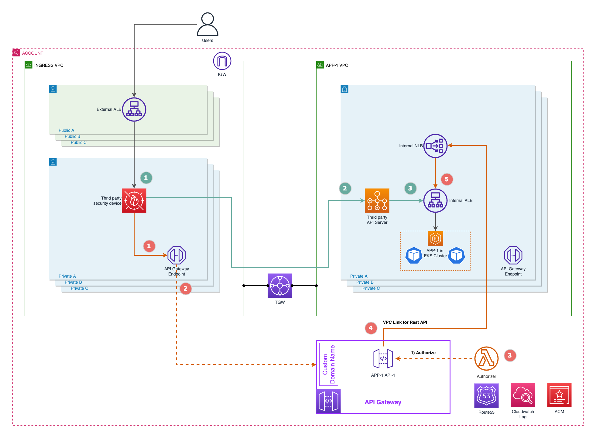

```ad-attention
title: This is a github note

```

# 私有 API Gateway 在企业场景中的应用

- [前言](#%E5%89%8D%E8%A8%80)
- [架构描述](#%E6%9E%B6%E6%9E%84%E6%8F%8F%E8%BF%B0)
- [搭建实验环境](#%E6%90%AD%E5%BB%BA%E5%AE%9E%E9%AA%8C%E7%8E%AF%E5%A2%83)
	- [环境准备](#%E7%8E%AF%E5%A2%83%E5%87%86%E5%A4%87)
	- [后端应用](#%E5%90%8E%E7%AB%AF%E5%BA%94%E7%94%A8)
	- [API Gateway](#api-gateway)
		- [步骤 1-2](#%E6%AD%A5%E9%AA%A4-1-2)
		- [步骤 4](#%E6%AD%A5%E9%AA%A4-4)
		- [步骤 5-7](#%E6%AD%A5%E9%AA%A4-5-7)
		- [步骤 9-10](#%E6%AD%A5%E9%AA%A4-9-10)
		- [步骤 12](#%E6%AD%A5%E9%AA%A4-12)
- [结论](#%E7%BB%93%E8%AE%BA)
- [参考资料](#%E5%8F%82%E8%80%83%E8%B5%84%E6%96%99)


## 前言

Amazon API Gateway 是亚马逊云科技的一项托管服务，可以帮助开发人员轻松创建、发布、维护、监控和保护任意规模的 API。越来越多的客户在其应用云原生改造中（构建新应用或改造旧应用）使用 Amazon API Gateway 托管服务替换现有应用架构中的第三方 API 网关服务，以实现降低维护管理成本、按需使用提高投入产出比、充分利用云的弹性扩展能力满足业务峰值等价值。使用托管服务并不是简单的替换现有组件，而是需要额外考虑企业已有的安全策略和网络架构等因素，包括：如何保证流量始终保持在 VPC 内部，或者 AWS 的可信网络内部；如何与已有的其他组件交互保证架构的延续性；如何进行访问控制满足企业安全合规要求等。


## 架构描述

在企业用户场景中大量使用第三方安全设备，普遍采用集中式 Ingress 的 ELB Sandwich 架构（详见[博客](https://aws.amazon.com/blogs/networking-and-content-delivery/design-your-firewall-deployment-for-internet-ingress-traffic-flows/)）。我们以此为典型架构，详细分析该架构中使用 Amazon API Gateway 替换第三方 API 网关服务时的数据流。

我们先来看下该架构中使用第三方 API 网关服务时的数据流（下图绿色数字标记）：
- 1： 外部应用负载均衡（External ALB）， 基于最小暴露原则，将仅需要提供对外访问的 API 暴露到公网；
- 2： 第三方安全设备，所有流量将经过企业内部专有的安全设备进行 7 层的流量过滤和防护 ；
- 3： 经过过滤的流量将转发到第三方 API 网关服务上，然后完成鉴权和请求转发；
- 4： 请求访问到内部应用负载均衡（Internal ALB），最终访问到应用服务；

架构注释：
- 使用独立的 Ingress VPC 可以更好的实现架构扩展性，可以有多个 App VPC 存在，相互独立的同时，附加到 TGW 实现统一的南北向流量管控；
- 扩展到多账号的场景时，可以将 Ingress VPC 置于独立安全账号，将 App VPC  和 API Gateway 等置于应用账号，更清晰的管理权限边界；



Amazon API Gateway 可以直接暴露到公网访问，无需前置任何负载均衡，并且可以使用 AWS 原生的 Web Application Firewall (WAF) 进行过滤和防护，但是本文架构中使用第三方安全设备的原因在于符合公司整体安全策略规范，且可以充分利用已有的安全设备的投资。同时提供更多的优势，包括：实现逐步应用改造、降低管理成本、弹性扩展等。

我们再来分析下使用 Amazon API Gateway 的数据流（上图红色数字标注）：
- 1： 保持对外暴露的架构不变，流量从外部应用负载均衡经过安全设备进行 7 层过滤后访问到 API Gateway 的 VPC Endpoint；
- 2： 请求流量进入 VPC Endpoint 后，将由 API Gateway 进行处理，此时流量虽然已经离开用户的 VPC，但是依然保留在 AWS 可信网络内部；
- 3： 所有请求在转发到下游应用之前需要验证鉴权有效，一般使用 Lambda Authorizer 实现。例如，验证请求中自带的 Access Token 有效；
- 4： 验证鉴权有效之后，请求将通过 VPC Link 访问到客户 VPC 中的应用服务，使用 VPC Link 可以保证请求流量直接进入用户的 VPC 内部而不会传输到公网；
- 5： 由于应用发布在内部应用负载均衡（Internal ALB）上，Rest API 类型的 VPC Link 支持通过网络负载均衡（NLB）将请求转发到内部应用负载均衡上，最终访问应用服务；

架构注释：
- 从数据流中可以看出，原有跨 VPC 的数据会经过 Amazon Transit Gateway (TGW)，使用 API Gateway 之后数据将从 AWS 可信网络内部传输，不再需要原有 TGW 组件；
- 与原有架构相比新增了网络负载均衡 ，但是不会对于链路吞吐能力造成瓶颈，因为网络负载均衡属于 4 层协议转发，详见[博客](https://aws.amazon.com/blogs/compute/understanding-vpc-links-in-amazon-api-gateway-private-integrations/)；

本文验证以下内容：
- 使用私有 API Gateway 替代原有第三方 API 网关服务；
- 整个请求链路上使用域名及证书验证有效，且内网服务发布可以使用自签名证书；
- 基于企业安全合规要求，数据流量需要始终保持在客户 VPC 内部以及 AWS 可信网络内部传输，不会意外传输到公网；
- 标头传递到下游应用中使用，以及使用特定标头定制 Access Log


## 搭建实验环境

本文所涉及到的代码可以从 [Github](https://github.com/panlm/blog-private-api-gateway-dataflow) 获取到最新版本。完成本章节后将创建下列资源：
- Ingress VPC - 使用所在区域中的默认 VPC
	- Cloud9 - 交互实验环境
	- Elastic Load Balancer - External ALB 用于接收外部请求
	- VPC Endpoint -  用于私有 API 
- App VPC - 创建 EKS 集群时自动创建
	- EKS Cluster - 后端应用运行
	- Elastic Load Balancer - Internal ALB 用于应用 Ingress 
	- Elastic Load Balancer - Internal NLB 用于 VPC Link
- 其他资源
	- Route53 Hosted Zone - 实验环境的 DNS
	- Amazon Certificate Manager - 实验环境所需证书 
	- CloudWatch Logs - 用于收集 API Gateway 的 Access Log

### 环境准备

本文使用 AWS Global 的账号，在区域 us-east-2 中搭建。按照下面步骤创建相关的资源：
- 使用 AWS Cloud9 作为实验环境的交互环境 ([链接](http://aws-labs.panlm.xyz/20-cloud9/setup-cloud9-for-eks.html))
- 创建 EKS 集群，名为 `ekscluster1` ([链接](http://aws-labs.panlm.xyz/100-eks-infra/110-eks-cluster/eks-public-access-cluster.html#create-eks-cluster))
	- 安装插件 AWS Load Balancer Controller ([链接](http://aws-labs.panlm.xyz/100-eks-infra/130-eks-network/aws-load-balancer-controller.html#install-))
	- 安装插件 ExternalDNS ([链接](http://aws-labs.panlm.xyz/100-eks-infra/130-eks-network/externaldns-for-route53.html#install-))
- 首先确保你有自己域名和域名服务器 (Domain Registrar)，然后在当前测试账号的 Route53 下创建 Hosted Zone，并且在上游域名服务器添加该 Hosted Zone 的 NS 记录，以实现二级域名解析 ([链接](http://aws-labs.panlm.xyz/100-eks-infra/130-eks-network/externaldns-for-route53.html#setup-hosted-zone-))
- 在 ACM 中创建带有通配符的证书，然后在 Route53 中添加相应的 DNS 记录以验证证书有效性 ([链接](http://aws-labs.panlm.xyz/900-others/990-command-line/acm-cmd.html#create-certificate-))
- 验证应用发布可用以及证书有效 ([链接](http://aws-labs.panlm.xyz/100-eks-infra/130-eks-network/externaldns-for-route53.html#verify))，如果验证成功，可以从 EKS 集群中删除名为 `verify`  的命名空间

### 后端应用

- 使用以下模版配置文件在 EKS 集群中创建 `httpbin` 应用，方便获取到请求中包含的必要信息
```sh
echo ${CERTIFICATE_ARN}
echo ${DOMAIN_NAME}

kubectl create ns httpbin

envsubst >httpbin.yaml <<-EOF
---
apiVersion: v1
kind: Service
metadata:
  name: httpbin
spec:
  type: NodePort
  ports:
  - port: 80
    name: http
    targetPort: 80
  selector:
    app: httpbin
---
apiVersion: apps/v1
kind: Deployment
metadata:
  name: httpbin
spec:
  selector:
    matchLabels:
      app: httpbin
  template:
    metadata:
      labels:
        app: httpbin
    spec:
      containers:
      - image: kennethreitz/httpbin
        name: httpbin
        ports:
        - containerPort: 80
          name: http
---
apiVersion: networking.k8s.io/v1
kind: Ingress
metadata:
  name: httpbin
  annotations:
    alb.ingress.kubernetes.io/scheme: internet-facing
    alb.ingress.kubernetes.io/tags: Environment=dev,Team=test,Application=httpbin
    alb.ingress.kubernetes.io/target-type: ip
    alb.ingress.kubernetes.io/listen-ports: '[{"HTTP": 80}, {"HTTPS": 443}]'
    alb.ingress.kubernetes.io/ssl-redirect: '443'
    alb.ingress.kubernetes.io/certificate-arn: ${CERTIFICATE_ARN}
    alb.ingress.kubernetes.io/group.name: intalb
    alb.ingress.kubernetes.io/group.order: '99'
spec:
  ingressClassName: alb
  rules:
    - host: httpbin.${DOMAIN_NAME}
      http:
        paths:
          - backend:
              service:
                name: httpbin
                port:
                  number: 80
            path: /
            pathType: Prefix
EOF

kubectl create --filename httpbin.yaml -n httpbin
```

- 等待 ALB 可用后，验证应用从外部可以正常访问
```sh
curl https://httpbin.${DOMAIN_NAME}/anything
```

- 我们将更新 Ingress 配置，将该 ALB 类型从 Internet-facing 改为 Internal，作为 API Gateway 的下游的 HTTP Endpoint
```sh
sed -i 's/internet-facing/internal/' httpbin.yaml
kubectl apply --filename httpbin.yaml -n httpbin
```

### API Gateway

我们来先梳理下请求经过 API Gateway 过程中需要经过那些组件以及相应的配置细节信息，包括需要绑定的域名以及证书信息，这样会有利于理解。


- 1 -  DNS 服务器上，将测试域名 `poc.xxx.com` 解析到外部的 ALB 上；
- 2 - 公有 CA 签发的证书（简称公有证书），配置在外部的 ALB 上，并且指定路径规则将请求进行转发；
- 3 - （可选）此处可以选配安全设备进行 7 层的流量过滤和防护。例如，上一步将请求转发到安全设备特定端口，该端口对应的规则将对所有进入流量进行过滤，然后继续将请求转发到下一步，即 API Gateway 的 VPC Endpoint；
- 4 - 创建 API Gateway 的 VPC Endpoint ，且禁用 `Enable private DNS names`；
- 5 - 创建私有 API ，配置 Resource Policy ，然后部署 API 到 Stage `v1` ，下一步中将使用这个 Stage 名称作为 Mapping 的一部分；
- 6 - 创建定制域名，需要与测试域名 `poc.xxx.com` 一致，且在 ACM 中有该域名的证书。创建 Mapping，将域名映射到特定 Stage 上，如果请求 URL 带有路径信息（ Path Pattern ），则需要填入对应路径信息；
- 7 - 创建 Rest 类型 VPC Link，需要提前创建 NLB 以及 ALB 类型的 Target Group，并将下游应用的 ALB 注册到该 Target Group 上；
- 8 - （可选）使用 Lambda 验证鉴权。一旦鉴权成功，便可从上下文中获取到必要的信息 ([链接](https://docs.aws.amazon.com/apigateway/latest/developerguide/api-gateway-mapping-template-reference.html#context-variable-reference:~:text=context.authorizer.property))。比如，使用 Lambda 鉴权请求中自带的 Access Token，成功之后可以从 Access Token 中获取到用户具体详情，作为 header 提供下游应用直接使用；
- 9 - 请求发送到内部应用 ALB 时，ALB 使用的证书是自签名证书，且提前导入到 ACM 中（未包含完整证书链），这样的证书使用在 ALB 上是没问题的，但是作为 API Gateway 下游请求的话，则会遇到问题；
	- 首先，API Gateway 默认无法验证自签名证书，除非启用 `tlsConfig/insecureSkipVerification` ([链接](https://aws.amazon.com/premiumsupport/knowledge-center/api-gateway-ssl-certificate-errors/))，且启用后也仅验证包含完整证书链的自签名证书；
	- 其次， 每个 API 的每个 Resource 的每个 Method 都需要单独通过命令行启用，通过这个脚本简化工作 ([链接](http://aws-labs.panlm.xyz/900-others/990-command-line/script-api-resource-method.html))。另外，可以通过导出带 `API Gateway extensions` 的格式修改，并重新导入覆盖；
- 10 - 导入其他需要测试的 API ，提前提升上限 `Resources per API` （默认 300，详见[链接](https://docs.aws.amazon.com/apigateway/latest/developerguide/limits.html)）；
- 11 - 应用 ALB，证书需要满足步骤 9；
- 12 - 验证，通过测试域名 `poc.xxx.com` 直接访问私有 API；

#### 步骤 1-2 

**External ALB**
- 在 Cloud9 所在的 VPC 中，创建外部负载均衡
```sh
UNIQ_STR=$RANDOM
PORT443=443
POC_HOSTNAME=poc.${DOMAIN_NAME}
URI_PREFIX=uri-prefix

echo ${CERTIFICATE_ARN}
echo ${CLUSTER_NAME}
echo ${AWS_DEFAULT_REGION}

# get cloud9 vpc
C9_INST_ID=$(curl http://169.254.169.254/1.0/meta-data/instance-id 2>/dev/null)
C9_VPC_ID=$(aws ec2 describe-instances \
--instance-ids ${C9_INST_ID} \
--query 'Reservations[0].Instances[0].VpcId' --output text)

# get public subnet for external alb
C9_SUBNETS_ID=$(aws ec2 describe-subnets \
--filter "Name=vpc-id,Values=${C9_VPC_ID}" \
--query 'Subnets[?MapPublicIpOnLaunch==`true`].SubnetId' \
--output text)

# get default security group 
C9_DEFAULT_SG_ID=$(aws ec2 describe-security-groups \
--filter Name=vpc-id,Values=${C9_VPC_ID} \
--query "SecurityGroups[?GroupName == 'default'].GroupId" \
--output text)

# allow 80/443 from anywhere
for i in 80 443 ; do
aws ec2 authorize-security-group-ingress \
  --group-id ${C9_DEFAULT_SG_ID} \
  --protocol tcp \
  --port $i \
  --cidr 0.0.0.0/0  
done

# create external alb
aws elbv2 create-load-balancer --name ext-alb-${UNIQ_STR} \
--subnets ${C9_SUBNETS_ID} \
--security-groups ${C9_DEFAULT_SG_ID} |tee /tmp/$$.1
alb1_arn=$(cat /tmp/$$.1 |jq -r '.LoadBalancers[0].LoadBalancerArn')
alb1_dnsname=$(cat /tmp/$$.1 |jq -r '.LoadBalancers[0].DNSName')

aws elbv2 create-target-group \
--name ext-alb-tg-${PORT443}-${UNIQ_STR} \
--protocol HTTPS \
--port ${PORT443} \
--target-type ip \
--vpc-id ${C9_VPC_ID} \
--matcher HttpCode="200-202\,400-404" |tee /tmp/$$.2
tg1_arn=$(cat /tmp/$$.2 |jq -r '.TargetGroups[0].TargetGroupArn')

aws elbv2 create-listener --load-balancer-arn ${alb1_arn} \
--protocol HTTPS --port ${PORT443}  \
--certificates CertificateArn=${CERTIFICATE_ARN} \
--default-actions Type=fixed-response,FixedResponseConfig="{MessageBody=,StatusCode=404,ContentType=text/plain}" |tee /tmp/$$.2.1
listener_arn=$(cat /tmp/$$.2.1 |jq -r '.Listeners[0].ListenerArn')

# rules with path pattern in listener 
envsubst >/tmp/path-pattern.json <<-EOF
[
    {
        "Field": "path-pattern",
        "PathPatternConfig": {
            "Values": ["/${URI_PREFIX}/*"]
        }
    }
]
EOF

aws elbv2 create-rule --listener-arn ${listener_arn} \
--conditions file:///tmp/path-pattern.json \
--priority 5 \
--actions Type=forward,TargetGroupArn=${tg1_arn}
```

**Route53** 
- 创建 CNAME 记录，将测试域名映射到外部负载均衡的默认域名上
```sh
echo ${POC_HOSTNAME}
echo ${alb1_dnsname}

envsubst >poc-route53-record.json <<-EOF
{
  "Comment": "UPSERT a record for poc.xxx.com ",
  "Changes": [
    {
      "Action": "UPSERT",
      "ResourceRecordSet": {
        "Name": "${POC_HOSTNAME}",
        "Type": "CNAME",
        "TTL": 300,
        "ResourceRecords": [
          {
            "Value": "${alb1_dnsname}"
          }
        ]
      }
    }
  ]
}
EOF

ZONE_ID=$(aws route53 list-hosted-zones-by-name \
--dns-name "${DOMAIN_NAME}." \
--query HostedZones[0].Id --output text)

aws route53 change-resource-record-sets --hosted-zone-id ${ZONE_ID} --change-batch file://poc-route53-record.json

aws route53 list-resource-record-sets --hosted-zone-id ${ZONE_ID} --query "ResourceRecordSets[?Name == '${POC_HOSTNAME}.']"
```

#### 步骤 4

**API Gateway VPCE**
- 在 Cloud9 所在的 VPC 中，创建 API Gateway 的 VPC Endpoint，这是使用私有 API 的前置条件
```sh
echo ${C9_VPC_ID}
echo ${C9_SUBNETS_ID}
echo ${C9_DEFAULT_SG_ID}

aws ec2 create-vpc-endpoint \
--vpc-id ${C9_VPC_ID} \
--vpc-endpoint-type Interface \
--service-name com.amazonaws.${AWS_DEFAULT_REGION}.execute-api \
--subnet-ids ${C9_SUBNETS_ID} \
--security-group-id ${C9_DEFAULT_SG_ID} \
--no-private-dns-enabled |tee /tmp/$$.3
ENDPOINT_ID=$(cat /tmp/$$.3 |jq -r '.VpcEndpoint.VpcEndpointId')
ENDPOINT_ENI=$(cat /tmp/$$.3 |jq -r '.VpcEndpoint.NetworkInterfaceIds[]' |xargs )

# wait until available
watch -g -n 10 aws ec2 describe-vpc-endpoints \
--vpc-endpoint-ids ${ENDPOINT_ID} \
--query 'VpcEndpoints[0].State'

# get endpoint ip address
ENDPOINT_ENI_IP=$(aws ec2 describe-network-interfaces --network-interface-ids ${ENDPOINT_ENI} --query 'NetworkInterfaces[].PrivateIpAddress' --output text)

# add ip address to alb's target group
targets=$(for i in ${ENDPOINT_ENI_IP} ; do
  echo "Id=$i"
done |xargs )

aws elbv2 register-targets \
--target-group-arn ${tg1_arn} \
--targets ${targets}
```

#### 步骤 5-7

**VPC Link**
- 在 EKS 所在的 VPC 中，为应用的内部负载均衡 (ALB) 创建 NLB
```sh
# get eks vpc id
EKS_VPC_ID=$(aws eks describe-cluster \
--name ${CLUSTER_NAME} \
--query "cluster.resourcesVpcConfig.vpcId" --output text )

EKS_PRIV_SUBNETS_ID=$(aws ec2 describe-subnets \
--filter "Name=vpc-id,Values=${EKS_VPC_ID}" \
--query 'Subnets[?MapPublicIpOnLaunch==`false`].SubnetId' \
--output text)

INT_ALB_DNS_NAME=$(kubectl get ing httpbin -n httpbin --output json  |jq -r '.status.loadBalancer.ingress[].hostname' )

INT_ALB_ARN=$(aws elbv2 describe-load-balancers --query "LoadBalancers[?DNSName=='${INT_ALB_DNS_NAME}'][].LoadBalancerArn" --output text)

# create alb-type target group
aws elbv2 create-target-group \
--name int-nlb-tg-alb-${UNIQ_STR} \
--protocol TCP \
--port ${PORT443} \
--target-type alb \
--vpc-id ${EKS_VPC_ID} |tee /tmp/$$.4
tg2_arn=$(cat /tmp/$$.4 |jq -r '.TargetGroups[0].TargetGroupArn')

# register alb to tg
# will failed, if your alb status is not active
aws elbv2 register-targets \
--target-group-arn ${tg2_arn} \
--targets Id=${INT_ALB_ARN}

# create nlb
aws elbv2 create-load-balancer \
--name int-nlb-${UNIQ_STR} \
--type network \
--scheme internal \
--subnets ${EKS_PRIV_SUBNETS_ID} |tee /tmp/$$.5
nlb1_arn=$(cat /tmp/$$.5 |jq -r '.LoadBalancers[0].LoadBalancerArn')

# create listener for nlb
aws elbv2 create-listener --load-balancer-arn ${nlb1_arn} \
--protocol TCP --port ${PORT443}  \
--default-actions Type=forward,TargetGroupArn=${tg2_arn}

# wait until active
watch -g -n 60 aws elbv2 describe-load-balancers \
--load-balancer-arns ${nlb1_arn} \
--query 'LoadBalancers[0].State'
```

- 等待 NLB 状态可用后，创建 VPC Link
```sh
# create vpc link
aws apigateway create-vpc-link --name vpclink-rest \
--target-arns ${nlb1_arn} |tee /tmp/$$.6
VPCLINK_ID=$(cat /tmp/$$.6 |jq -r '.id')

# wait about 10 mins until AVAILABLE
watch -g -n 60 aws apigateway get-vpc-link \
--vpc-link-id ${VPCLINK_ID} \
--query 'status'
```

####  步骤 9-10 

**API with VPC Link**


- 使用下面代码块创建类似上图的 API
```sh
API_NAME=MyAPI-${UNIQ_STR}
echo ${API_NAME}
echo ${VPCLINK_ID}
echo ${ENDPOINT_ID}
echo ${DOMAIN_NAME}

envsubst >api-definition.yml <<-EOF
---
swagger: "2.0"
info:
  version: "2023-04-10T06:38:46Z"
  title: "${API_NAME}"
basePath: "/uri-prefix"
schemes:
- "https"
paths:
  /httpbin:
    get:
      responses: {}
      x-amazon-apigateway-integration:
        connectionId: "${VPCLINK_ID}"
        httpMethod: "GET"
        uri: "https://httpbin.${DOMAIN_NAME}/anything"
        responses:
          default:
            statusCode: "200"
        passthroughBehavior: "when_no_match"
        connectionType: "VPC_LINK"
        tlsConfig:
          insecureSkipVerification: true
        type: "http_proxy"
  /httpbin/{proxy+}:
    x-amazon-apigateway-any-method:
      consumes:
      - "application/json"
      parameters:
      - name: "xff"
        in: "header"
        required: false
        type: "string"
      - name: "proxy"
        in: "path"
        required: true
        type: "string"
      responses: 
        "200":
          description: "200 response"
      x-amazon-apigateway-integration:
        connectionId: "${VPCLINK_ID}"
        httpMethod: "ANY"
        uri: "https://httpbin.${DOMAIN_NAME}/{proxy}"
        responses:
          default:
            statusCode: "200"
        requestParameters:
          integration.request.path.proxy: "method.request.path.proxy"
          integration.request.header.xff: "method.request.header.xff"
        passthroughBehavior: "when_no_templates"
        connectionType: "VPC_LINK"
        type: "http"
#        cacheNamespace: "bv1a7a"
#        cacheKeyParameters:
#        - "method.request.path.proxy"
EOF

cat >api-definition-template.yml <<-'EOF'
        requestTemplates:
          application/json: |
            #set($xffValue = "$input.params('X-Forwarded-For')")
            $input.json("$")
            #set($context.requestOverride.header.xff = $xffValue)
EOF

envsubst >api-definition-policy.yml <<-EOF
x-amazon-apigateway-policy:
  Version: "2012-10-17"
  Statement:
  - Effect: "Deny"
    Principal: "*"
    Action: "execute-api:Invoke"
    Resource: "execute-api:/*/*/*"
    Condition:
      StringNotEquals:
        aws:sourceVpce: 
        - "${ENDPOINT_ID}"
  - Effect: "Allow"
    Principal: "*"
    Action: "execute-api:Invoke"
    Resource: "execute-api:/*/*/*"
EOF

cat api-definition.yml api-definition-template.yml api-definition-policy.yml >api-definition-full.yml

aws apigateway import-rest-api \
--parameters endpointConfigurationTypes=PRIVATE \
--body fileb://api-definition-full.yml |tee /tmp/$$.7
API_ID=$(cat /tmp/$$.7 |jq -r '.id')

aws apigateway create-deployment \
--rest-api-id ${API_ID} --stage-name v1 
```

**Custom Domain Name**
- 创建定制域名，注意路径与外部应用负载均衡上的转发路径一致
```sh
echo ${CERTIFICATE_ARN}
echo ${POC_HOSTNAME}
echo ${URI_PREFIX}

aws apigateway create-domain-name \
--domain-name ${POC_HOSTNAME} \
--endpoint-configuration types=REGIONAL \
--regional-certificate-arn ${CERTIFICATE_ARN} 

aws apigateway create-base-path-mapping \
--domain-name ${POC_HOSTNAME} \
--rest-api-id ${API_ID} \
--stage v1 \
--base-path "${URI_PREFIX}"
```

**Custom Access Logging**
API Gateway 中，可以配置两种不同类型日志，API 日志和 Access Log 日志。

- 执行下面代码块创建专用角色，获取 Role ARN，然后将角色添加到 `Settings` （参考[文档](https://docs.aws.amazon.com/apigateway/latest/developerguide/set-up-logging.html#set-up-access-logging-using-console)）
```sh
ROLE_NAME=apigatewayrole-$(date +%Y%m%d-%H%M)
echo '{
    "Version": "2012-10-17",
    "Statement": [
        {
            "Sid": "",
            "Effect": "Allow",
            "Principal": {
                "Service": [
                    "apigateway.amazonaws.com"
                ]
            },
            "Action": [
                "sts:AssumeRole"
            ]
        }
    ]
}' |tee role-trust-policy.json
aws iam create-role --role-name ${ROLE_NAME} \
  --assume-role-policy-document file://role-trust-policy.json
aws iam attach-role-policy --role-name ${ROLE_NAME} \
  --policy-arn "arn:aws:iam::aws:policy/service-role/AmazonAPIGatewayPushToCloudWatchLogs"
aws iam list-attached-role-policies --role-name ${ROLE_NAME}

role_arn=$(aws iam get-role --role-name ${ROLE_NAME} |jq -r '.Role.Arn')

echo ${role_arn}

###
# copy above output
# add role to api gateway settings
###
```

- 创建专用 CloudWatch 日志组
```sh
LOGGROUP_NAME=apigw-access-log
aws logs create-log-group \
--log-group-name ${LOGGROUP_NAME}
LOGGROUP_ARN=$(aws logs describe-log-groups \
--log-group-name-prefix ${LOGGROUP_NAME} \
--query 'logGroups[0].arn' --output text)
LOGGROUP_ARN=${LOGGROUP_ARN%:*}
```

- 更新现有 API 的 Stage 配置，定制 Access Log 日志输出格式
```sh
echo ${API_ID}
echo ${LOGGROUP_ARN}

echo '{ 
	"requestId": "$context.requestId", 
	"caller": "$context.identity.caller", 
	"user": "$context.identity.user",
	"requestTime": "$context.requestTime", 
	"httpMethod": "$context.httpMethod",
	"resourcePath": "$context.resourcePath", 
	"status": "$context.status",
	"protocol": "$context.protocol", 
	"responseLength": "$context.responseLength",
	"ip": "$context.identity.sourceIp", 
	"xff": "$context.requestOverride.header.xff"
}' |tee access-log-format.json

format_str=$(cat access-log-format.json |sed 's/"/\\"/g' |xargs |sed 's/"/\\"/g')

echo '{"patchOperations": []}' |\
jq '.patchOperations[0] = {"op": "replace", "path": "/accessLogSettings/format", "value": "'"${format_str}"'"}' |\
jq '.patchOperations[1] = {"op": "replace", "path": "/accessLogSettings/destinationArn", "value": "'"${LOGGROUP_ARN}"'"}' |tee access-log-settings.json

aws apigateway update-stage \
--rest-api-id $API_ID \
--stage-name v1 \
--cli-input-json file://access-log-settings.json
```

#### 步骤 12

**验证应用可用**
- 从其他设备浏览器访问下面链接时，将请求 API `/httpbin`。该 API 启用 `Use Proxy Integration` 
```sh
echo "curl https://${POC_HOSTNAME}/${URI_PREFIX}/httpbin"
```


**查看请求的数据流**
- 从上图 `origin` 字段可以看到完整的请求数据流
	- 第一个地址为客户端地址；
	- 第二个地址为 Cloud9 的 VPC 中，外部负载均衡（External ALB）的内网地址；
	- 第三个地址为 EKS 的 VPC 中，网络负载均衡（NLB）的内网地址；

**自定义标头**
- 从其他设备浏览器访问下面链接时，将请求 API `/httpbin/{proxy+}`。该 API 未启用 `Use Proxy Integration`，原因是我们需要传递自定义标头到下游应用中使用
```sh
echo "curl https://${POC_HOSTNAME}/${URI_PREFIX}/httpbin/anything"
```


**查看下游应用可获取到的标头**
- 上图中可以看到，下游应用返回的 headers 中包含了我们在 API 中自定义的标头 `xff`，用来获取请求中的 `X-Forwarded-For` 标头。同时可以将这个标头保存到 Access Log 中（如下图），用于安全审计目的；
- 由于我们使用了私有 API，因此API Gateway 自带的 `$context.identity.sourceIp` 始终为外部应用负载均衡的内网地址。通过自定义标头 `xff` 获取更详细的信息；


## 结论

为了替换企业现有应用架构中的第三方 API 网关服务，且满足目前合规性要求，可以使用 Amazon API Gateway 创建私有 API，通过 VPC Endpoint 来保证访问 API 的请求保留在 VPC 内部，使用 VPC Link 功能将请求应用的流量直接导入 VPC 而不会经过公网传输，从而确保安全性。结合企业内部的第三方安全组件时，可以在 VPC Endpoint 之前添加外部应用负载均衡和企业内部的第三方安全设备进行过滤和防护。同时使用统一域名访问，我们会使用自定义域名关联外部应用负载均衡，在 API Gateway 上使用同样的自定义域名作为定制域名关联单个或者多个 API 的 Stage。  
  
这样的架构可以作为目前企业内部使用第三方 API 网关服务的一个替代方案且沿用已有的安全组件。整个请求数据流均在 VPC 内部或者 AWS 可信网络内部，链路上使用域名及证书均可沿用现有配置，且如果内网服务发布使用自签名证书时也可以支持。


## 参考资料

- https://github.com/markilott/aws-cdk-internal-private-api-demo
- https://aws.amazon.com/cn/blogs/china/private-api-integration-across-accounts-and-networks-based-on-amazon-api-gateway/
- https://docs.aws.amazon.com/zh_cn/apigateway/latest/developerguide/apigateway-override-request-response-parameters.html#apigateway-override-request-response-parameters-override-request


