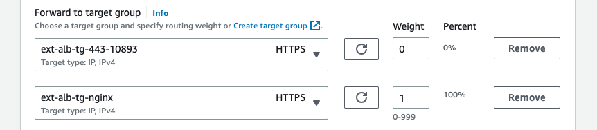

```ad-attention
title: This is a github note

```

# fake-waf-on-ec2-forwarding-https

- [Diagram](#diagram)
- [Layer 7 forwarding with NGINX (prefer)](#layer-7-forwarding-with-nginx-prefer)
- [Layer 4 forwarding with iptables](#layer-4-forwarding-with-iptables)


## Diagram

In blog's diagram, we mentioned when you expose private API, need using ALB + WAF to keep it security. But we do not include this part in lab, we added API gateway endpoint's IP addresses to ALB directly. 
If you try to simulate WAF component in this scenario, follow one of next two chapters to create fake WAF (the "Layer 7 forwarding with NGINX" is prefer) and then add fake WAF's IP address to ALB instead of endpoint's IP addresses.

## Layer 7 forwarding with NGINX (prefer)

- amazon linux 2
- download nginx ([link](http://nginx.org/download/))
```sh
wget http://nginx.org/download/nginx-1.23.4.tar.gz
```
- get http_connect patch based on your nginx version ([link](https://github.com/chobits/ngx_http_proxy_connect_module#install))
```sh
yum install -y git pcre2 pcre2-devel openssl-devel
git clone https://github.com/chobits/ngx_http_proxy_connect_module.git
```
- re-compile
```sh
yum groupinstall -y 'Development Tools'
tar xf nginx-1.23.4.tar.gz
cd nginx-1.23.4
patch -p1 < ../ngx_http_proxy_connect_module/patch/proxy_connect_rewrite_102101.patch
./configure \
--user=www \
--group=www \
--prefix=/usr/local/nginx \
--with-http_ssl_module \
--with-http_stub_status_module \
--with-http_realip_module \
--with-threads \
--add-module=../ngx_http_proxy_connect_module
make && make install
```
- create cerntificate in `/usr/local/nginx/conf` ([[self-signed-certificates#2. no certificate chain]] or [link](http://aws-labs.panlm.xyz/100-eks-infra/130-eks-network/self-signed-certificates.html#2-no-certificate-chain))
```sh
mkdir ~/cert
cd ~/cert
openssl req -x509 -nodes -days 365 -newkey rsa:2048 -keyout privateKey.key -out certificate.crt
###
# setup Common name to *.panlm.xyz
###
openssl rsa -in privateKey.key -check
openssl x509 -in certificate.crt -text -noout
openssl rsa -in privateKey.key -text > private.pem
openssl x509 -inform PEM -in certificate.crt > public.pem

ln -sf ~/cert/public.pem /usr/local/nginx/conf/cert.pem
ln -sf ~/cert/private.pem /usr/local/nginx/conf/cert.key
```
- edit `/usr/local/nginx/conf/nginx.conf`
```conf
...
  server {
    listen  443 ssl;

    ssl_certificate    cert.pem;
    ssl_certificate_key  cert.key;

    ssl_session_cache  shared:SSL:1m;
    ssl_session_timeout  5m;

    ssl_ciphers  HIGH:!aNULL:!MD5;
    ssl_prefer_server_ciphers  on;

    # dns resolver used by forward proxying
    # resolver  172.31.80.2;

    # forward proxy for CONNECT request
    proxy_connect;
    proxy_connect_allow      443;
    proxy_connect_connect_timeout  10s;
    proxy_connect_read_timeout   10s;
    proxy_connect_send_timeout   10s;

    # forward proxy for non-CONNECT request
    location / {
      proxy_pass "https://vpce-xxx-xxx.execute-api.us-east-1.vpce.amazonaws.com";
      proxy_set_header Host "poc.api0413.aws.panlm.xyz";
    }
  }
...
```
- start nginx
```sh
groupadd www
useradd -g www www
/usr/local/nginx/sbin/nginx
```
- check access log for alb health check 
```
172.31.3.235 - - [17/Jul/2023:08:39:45 +0000] "GET / HTTP/1.1" 403 23 "-" "ELB-HealthChecker/2.0"
172.31.46.247 - - [17/Jul/2023:08:39:46 +0000] "GET / HTTP/1.1" 403 23 "-" "ELB-HealthChecker/2.0"
```
- put the fake WAF in the AZ in which your ALB enabled if your ALB not enabled in every AZ


## Layer 4 forwarding with iptables
this option could only forward traffic to one of endpoint ip addresses, not forward traffic to vpce domain name. 

- need `ip_forward=1` in OS
```sh
# Enable IP Forwarding and persist across reboot:
# sysctl -w net.ipv4.ip_forward=1;
echo "net.ipv4.ip_forward = 1" >> /etc/sysctl.d/00-defaults.conf
sysctl -p /etc/sysctl.d/00-defaults.conf 
```
- need stop source/dest check in EC2
- install and flush iptables
```sh
yum install -y iptables-services
systemctl enable iptables;
systemctl start iptables;

# Configuration below allows allows all traffic:
# Set the default policies for each of the built-in chains to ACCEPT:
iptables -P INPUT ACCEPT;
iptables -P FORWARD ACCEPT;
iptables -P OUTPUT ACCEPT;

# Flush the nat and mangle tables, flush all chains (-F), and delete all non-default chains (-X):
iptables -t nat -F;
iptables -t mangle -F;
iptables -F;
iptables -X;
```
- configure
```sh
instance_ip=172.31.82.94
vpce_ip=172.31.90.106 # one ip address of vpce domain name

# get alb internal ip addresses
for i in 172.31.73.14 172.31.3.235 172.31.90.92 172.31.63.94 172.31.31.15 172.31.46.17; do
  iptables -t nat -A PREROUTING -p tcp -s $i -d $instance_ip -i eth0 -j DNAT --to-destination $vpce_ip:443;
done

iptables -t nat -A POSTROUTING -p tcp --dport 443 -s 172.31.0.0/16 -d $vpce_ip -o eth0 -j MASQUERADE;
```


## refer
- https://docs.nginx.com/nginx/admin-guide/security-controls/securing-http-traffic-upstream/
- https://www.alibabacloud.com/blog/how-to-use-nginx-as-an-https-forward-proxy-server_595799


